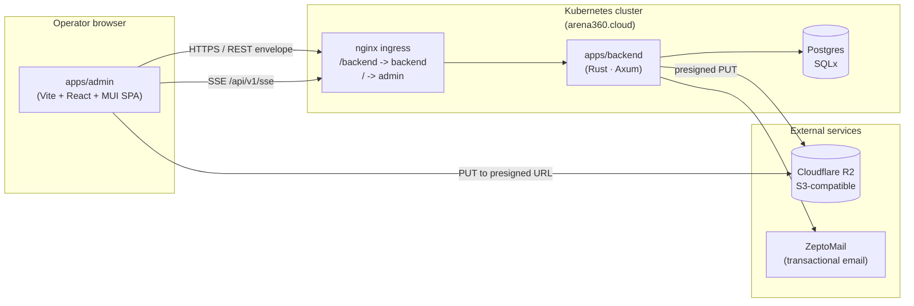
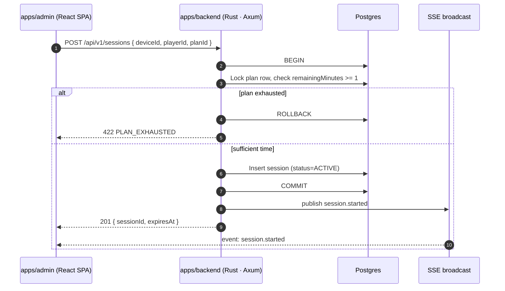
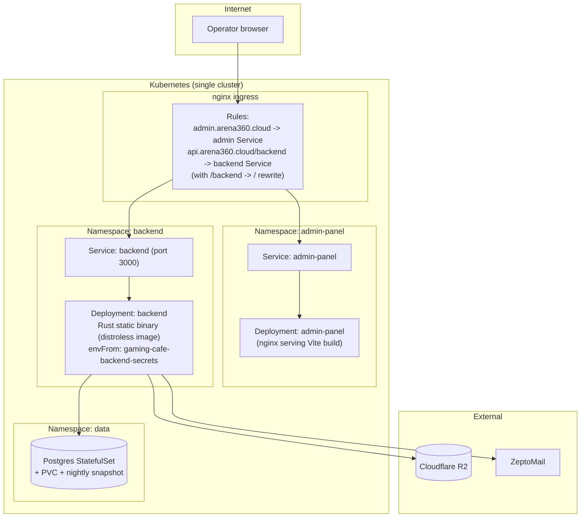

# ARCHITECTURE: Arena360 Gaming-Cafe Monorepo

> Living document. Update whenever a module boundary, contract, or
> integration point changes.
> Last updated: 2026-05-27.

## Pattern selection

Per `01-system-design.mdc`, the two deployable surfaces use different
architectural patterns, each chosen for its specific shape:

| Surface | Pattern | Rationale |
|---|---|---|
| `apps/backend` | **Layered monolith** (handlers → services → repositories → models) | Small team, single bounded context (one cafe). Rust (Axum) with SQLx for compile-time-checked queries against the existing Postgres schema. Microservices are not justified at this scale. |
| `apps/admin` | **Feature-sliced** Vite + React + MUI SPA | Each feature owns its routes, pages, components, hooks, services. Cross-feature reuse goes through `packages/*`, never feature-to-feature imports. |
| `packages/*` | **Pure libraries** | Zero imports from `apps/*`; framework-light; build once, consume everywhere. |

## Tech stack

| Layer | Technology | Version / Notes |
|---|---|---|
| Language | Rust | 2021 edition |
| HTTP framework | Axum | 0.7 |
| Async runtime | Tokio | multi-threaded |
| Database driver | SQLx | 0.7, Postgres, compile-time query checking |
| OpenAPI docs | utoipa | auto-generated from handler types |
| JWT | jsonwebtoken | RS256 / HS256 |
| Serialization | serde + serde_json | throughout |
| SSE | axum + tokio::broadcast | per-connection topic filtering |

The existing Postgres schema (originally created by TypeORM) is reused
as-is. SQLx queries are written against the existing tables and
columns; no ORM migration layer is introduced.

The default scaling story is **vertical** (bigger Postgres, bigger pod).
Horizontal scaling of the backend is supported (the API is stateless)
but not the default. If a second bounded context appears (e.g. a
billing engine), we extract it as a new app rather than splitting the
existing one.

---

## Target component diagram



Key facts:

- The ingress rewrites `/backend/*` to the backend service; everything
  else is served by the admin SPA (`admin.arena360.cloud`).
- File uploads always go **direct to R2** via presigned URLs. The
  backend never proxies bytes.
- The admin dashboard subscribes to `GET /api/v1/sse?topics=…` for
  real-time updates (session events, device status changes, plan
  alerts).

---

## Layer rules

### Backend (`apps/backend`)

Strict, top-down dependency:

```
handlers/     (HTTP handlers — request extraction, response mapping)
   │
   ▼
services/     (business logic, transactions, orchestration)
   │
   ▼
repositories/ (data access via SQLx — raw queries, compile-time checked)
   │
   ▼
models/       (domain structs, SQLx FromRow derives)
```

Supporting modules:

```
dto/          (request/response structs — serde Deserialize/Serialize + utoipa ToSchema)
middleware/   (auth JWT extraction, request logging, error handling)
error/        (AppError enum — implements IntoResponse for Axum)
sse/          (Server-Sent Events broadcaster — tokio::broadcast + per-connection filtering)
```

- **DTOs at the handler boundary.** Inbound: serde-deserialized
  structs with validation (e.g. `validator` crate). Outbound: response
  DTOs — never expose a raw SQLx row struct across the wire.
- **`AppError`** is a central enum in `error/` that implements Axum's
  `IntoResponse`. Each variant maps to an HTTP status code and an
  `ErrorCode` from `@gaming-cafe/contracts`. The envelope shape
  (`{ data, statusCode, message }` or `{ error }`) is identical to the
  previous API.
- **Repositories** return domain models to services; services translate
  to DTOs for handlers. This keeps SQL and query semantics inside the
  data layer.
- **Cross-cutting concerns** (JWT auth, request logging, rate limiting)
  are Axum middleware/extractors applied via `Router::layer()`. Auth is
  a custom extractor (`AuthUser`) that validates the JWT and injects
  the claims.
- **Module organization** mirrors business capabilities (`auth`,
  `device`, `plan`, `session`, `inventory`, `upload`, `dashboard`),
  each with its own handlers, services, repositories, and DTOs. Routes
  are composed in `main.rs` via `Router::merge()`.

### Admin frontend (`apps/admin`)

Feature-sliced layout:

```
apps/admin/src/
├── app/              # composition root: router, providers, error boundary
├── features/<name>/  # everything for one feature: routes, pages, components, hooks, services, types
│   └── index.ts      # the ONLY public surface of this feature
├── shared/           # in-app shared bits (small, app-specific)
└── main.tsx          # entry
```

Rules:

- A feature is consumed only via its `index.ts`. **Deep imports across
  features are forbidden** (`features/foo/internal/Bar` is private).
- Anything shared by two features moves to `packages/*`, not to
  `shared/`. `shared/` is for app-specific glue that does not warrant
  a package.
- Routing lives in `app/`. Features export route definitions; the
  router composes them.
- Data fetching uses the shared HTTP client from `@gaming-cafe/utils`
  (see Phase 4 in the plan); features must not re-instantiate axios.

### Packages (`packages/*`)

- Packages **must not import from any app**. They depend only on other
  packages and external libraries.
- Each package ships TypeScript sources + a `tsup`-produced `dist/` (or
  consumes the workspace via `tsconfig` path mappings during dev).
- Each package declares its peer deps narrowly (e.g. `packages/ui` peers
  on `react` and `@mui/material`, not on the apps).

---

## Package responsibilities

| Package | Purpose | Public surface (top-level exports) | Notable deps |
|---|---|---|---|
| `@gaming-cafe/api-types` | Generated TS types from the backend OpenAPI spec | `schema.ts` (full `paths` and `components`), `paths<>` helper, `operations<>` helper | `openapi-typescript` (devDep), zero runtime deps |
| `@gaming-cafe/contracts` | Runtime enums, pagination types, and role contracts shared across all workspaces (see ADR-0008) | `ErrorCode`, `ErrorMessages`, `getErrorMessage()`, `IPaginationParams`, `IPaginationResult<T>`, `UserRole`, `UserStatus` | none (zero deps) |
| `@gaming-cafe/ui` | MUI-based React components: `DataGrid`, `FormBuilder`, page layouts, dialogs, toolbar | `<DataGrid />`, `<FormBuilder />`, `<PageLayout />`, `<ConfirmDialog />` | `react`, `@mui/material`, `@mui/x-data-grid`, peers only |
| `@gaming-cafe/theme` | Design tokens (color, typography, spacing, radii) as TS exports **and** an emitted `tokens.css` file with CSS custom properties | `tokens` (TS object), `muiTheme` (MUI `Theme`), `./tokens.css` | `@mui/material` (peer) |
| `@gaming-cafe/providers` | Shared React providers (Theme, Toast, ErrorBoundary, QueryClient) | `<AppProviders />`, individual provider exports | `react`, `react-query` (or equivalent), peers |
| `@gaming-cafe/utils` | Axios HTTP client with envelope unwrapping + auth interceptors, validators, generic helpers | `createHttpClient()`, `unwrapEnvelope()`, `isApiError()`, validators | `axios` |
| `@gaming-cafe/biome-config` | Shared Biome ^2.4.15 config consumed by every workspace | `biome.json` snippet, exported as a config preset | `@biomejs/biome` |
| `@gaming-cafe/tsconfig` | Shared TypeScript configs | `base.json`, `node.json`, `react.json` | none |

### `@gaming-cafe/theme` — design tokens

- TS exports → consumed by admin via `muiTheme` (a real `@mui/material`
  `Theme`).
- Also emits `packages/theme/dist/tokens.css` with CSS custom properties
  for any future non-MUI consumer.

Token names (excerpt):

```
--gz-color-bg, --gz-color-fg, --gz-color-accent, --gz-color-danger
--gz-radius-sm, --gz-radius-md, --gz-radius-lg
--gz-spacing-1 .. --gz-spacing-8
--gz-font-sans, --gz-font-mono
--gz-shadow-1, --gz-shadow-2
```

See `adr/0007-design-tokens-shared.md` for the full rationale.

---

## Integration points

### REST envelope

Every backend response uses the same shape:

```jsonc
{
  "data":       <T>,            // omitted on error
  "statusCode": 200,
  "message":    "OK",
  "error":      {               // present only on error
    "code":      "PLAN_EXHAUSTED",
    "message":   "Plan has no remaining minutes",
    "details":   [ ... ],
    "requestId": "req-uuid",
    "timestamp": "2026-05-27T08:00:00Z"
  }
}
```

- Success: `statusCode` ∈ {200, 201, 204}; `data` is the payload.
- Error: matching HTTP status; `error.code` is a value from the
  `ErrorCode` enum in `@gaming-cafe/contracts`. The `ErrorMessages` map
  provides user-friendly messages for display.
- The shared HTTP client (`@gaming-cafe/utils`) unwraps `data` on
  success and throws a typed `ApiError` on failure, so feature code
  works with plain payloads.

### JWT bearer auth

- Header: `Authorization: Bearer <jwt>`.
- Single JWT kind: **user JWT** (admin operator).
- `JWT_SECRET` is validated at startup. No `"secret"` fallback — see
  `US-AUTH-004` and `adr/0003-secrets-management.md`.
- The Rust backend validates tokens via the `jsonwebtoken` crate. An
  `AuthUser` extractor parses and verifies the token, injecting claims
  into handler function signatures.

### Presigned R2 uploads

1. Client `POST /api/v1/uploads/sign` with `{ filename, contentType, size }`.
2. Backend validates size + content type, generates a presigned PUT URL
   (5-minute TTL) and a public URL, returns both.
3. Client uploads directly to R2 via `PUT uploadUrl` with the file body.
4. Client persists the resulting `publicUrl` against the entity
   (product image, plan banner) via the relevant resource endpoint.

The backend never proxies upload bytes; this keeps API memory flat
regardless of file size.

### ZeptoMail (transactional email)

- OTP delivery (`US-AUTH-001`), receipts (`US-ADMIN-006` if/when built).
- Configured via `ZEPTOMAIL_TOKEN` env var (rotated per
  `adr/0003-secrets-management.md`).
- Wrapped behind a `MailService` so swapping providers is one file.

### SSE (Server-Sent Events)

The backend provides a general-purpose event streaming endpoint:

- **Endpoint**: `GET /api/v1/sse?topics=session,device`
- **Architecture**: `tokio::broadcast` channel with per-connection filtering
- **Event types**: `session.started`, `session.ended`, `device.status_changed`, `plan.exhausted`, `plan.expired`, `transaction.created`
- **Format**: Standard SSE with JSON payload per event
- **Consumers**: Admin dashboard subscribes for real-time updates

Services publish events via an `EventService` that wraps the broadcast
channel. Each SSE connection receives only events matching its
subscribed topics.

---

## Data flow: admin starts a session for a player



Notes:

- The plan-minutes check is a transactional `SELECT ... FOR UPDATE`
  so concurrent requests cannot double-spend the same plan.
- The admin dashboard receives a `session.started` SSE event and
  updates the UI in real time without polling.
- Decrementing `remainingMinutes` is a backend-side job (a scheduled
  task or computed-on-read; see the `ScheduledTasksService` follow-up
  in the consolidation plan, Phase 6).

---

## Deployment topology



Operational notes:

- The backend is a single statically-linked Rust binary in a
  `gcr.io/distroless/static-debian12` Docker image (~10 MB). No
  runtime dependencies beyond libc.
- Backend container port is `3000` everywhere
  (Dockerfile healthcheck, Service, Deployment env).
- Secrets are loaded via `envFrom: secretRef: ...` on the backend
  deployment; nothing is in `values*.yaml`
  (see `adr/0003-secrets-management.md`).
- Admin is a static-asset deployment (nginx serving the Vite build);
  no runtime config beyond the API base URL injected at build time.

---

## Cross-cutting concerns

- **Logging**: structured JSON via `tracing` + `tracing-subscriber`
  (JSON layer). Frontends use a `logger` from `@gaming-cafe/utils` that
  mirrors the same fields so traces are joinable on `requestId`.
- **Error reporting**: `requestId` is generated at the ingress, echoed
  in every backend response, surfaced in the admin UI when an error
  toast is shown.
- **Config**: 12-factor. All config via env vars, parsed and validated
  at startup (Rust: `envy` or manual `std::env` with early panics). No
  `.env.production` baked into the image.
- **Time**: everything in UTC at rest; rendered in the cafe's local
  timezone in the UI (config: `CAFE_TZ`, default `Asia/Kolkata`).
- **Internationalisation**: not in scope yet. English only.

---

## What this architecture explicitly is not

- **Not microservices.** One backend process, one database.
- **Not event-sourced.** State is mutable rows in Postgres.
- **Not multi-tenant.** One deployment per cafe.
- **Not a full ORM.** SQLx provides compile-time-checked queries
  against the existing schema, not a migration or model-generation
  layer. The schema originated from TypeORM and is reused as-is.
