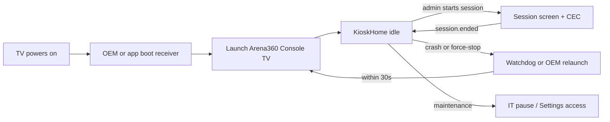

# Android TV Console TV deployment — startup, lockdown, and auto-restart

> Part of station deployment — see also [STATION-DEPLOYMENT-GUIDE.md](STATION-DEPLOYMENT-GUIDE.md)
> for the IT fleet checklist covering PC and Android TV stations.
>
> Operator + engineering guide for running Arena360 **Console TV** as a PlayStation
> station shell on Android TV / Google TV. Complements
> [DRAFT-0035](adr/DRAFT-0035-android-tv-console-station.md),
> [DRAFT-0037](adr/DRAFT-0037-console-tv-kiosk-style-provisioning.md), and
> [apps/console-tv/README.md](../apps/console-tv/README.md) (build / Fastlane / adb).

## What exists today (TV1)

| Capability | Status | Notes |
|------------|--------|-------|
| Admin-on-device provisioning (PS5/PS4) | **Shipped** | `POST /auth/login/admin` + `POST /devices/provision` ([DRAFT-0037](adr/DRAFT-0037-console-tv-kiosk-style-provisioning.md)) |
| KioskHome idle UI + looping video | **Shipped** | Same CDN asset as Windows kiosk (`launch.webm`) |
| WebSocket session sync + local clock | **Shipped** | `session.started` / `balance.updated` / `session.ended` |
| HDMI-CEC to PlayStation | **Shipped** | Degraded banner when CEC unavailable ([US-TV-007](REQUIREMENTS-CONSOLE-TV.md)) |
| Admin-started sessions only | **Shipped** | No player login on TV |
| Signed release APK/AAB (GitHub Release) | **Shipped** | [console-tv-release.yml](../.github/workflows/console-tv-release.yml) |
| Production API URL baked at build | **Shipped** | `VITE_API_URL` / `VITE_GATEWAY_URL` → `BuildConfig` |
| Boot auto-start | **Manual only** | No `BOOT_COMPLETED` receiver in app |
| OS kiosk / lockdown mode | **Not in app** | TV/OEM settings or MDM only |
| Auto-reopen after crash / force-stop | **Not implemented** | IT uses OEM auto-start or third-party launchers |
| OTA auto-update | **Not implemented** | Manual sideload from GitHub Release; future ADR |
| Play Store distribution | **Not configured** | `supply` not wired |

**Gap:** After power loss or the user force-stops the app, nothing relaunches Console TV
until IT configures OEM auto-start or a third-party boot launcher. There is no in-app
equivalent to Windows [ADR-0020](adr/0020-kiosk-windows-lockdown.md) — guests can still
reach the TV launcher unless the OEM restricts it.

---

## Target end state



---

## Layer 1 — OS / TV kiosk shell (operator / IT)

Choose **one** primary strategy per venue. Console TV is **sideloaded** today (signed APK
from GitHub Release). Play Store is not configured.

### Option A — OEM “start app on boot” (recommended when available)

Best when the TV brand exposes a reliable auto-start setting in consumer or service menus.

1. Sideload the production APK (see [§ Obtain APK](#obtain-apk)).
2. Enable **Developer options** if needed for adb maintenance.
3. In TV **Settings** (or service menu — Samsung, LG, Sony, TCL differ):
   - Find **Start app on boot**, **Auto-start**, or **Power-on app**.
   - Select **Arena360 Console TV** (`com.gamingcafe.consoletv`).
4. Enable **HDMI-CEC** (Anynet+, Bravia Sync, Simplink, etc.) for PlayStation input switch.
5. Restrict **Settings** / guest access where the OEM allows (parental controls).
6. Complete [first-time provisioning](#first-time-provisioning) on the device.

**Pros:** No app code change; works on many commercial TV panels.  
**Cons:** Not universal; Google TV often lacks a first-class “kiosk app” setting — verify per model.

### Option B — Default launcher / pinned home (limited)

Some Android TV builds allow pinning an app as the primary launcher experience.

1. Install Console TV.
2. Where supported, set Console TV as **Home** or remove competing launchers from the default
   apps list.
3. Disable or hide streaming apps not needed on the station.

**Pros:** Player lands in Arena360 after Home press.  
**Cons:** Google TV and many OEMs resist true launcher replacement; updates may reset defaults.

### Option C — Third-party “launch on boot” utility

Weakest official path; use when A/B are unavailable.

1. Sideload Console TV **and** a reputable auto-start utility from a vendor you trust.
2. Configure the utility to launch `com.gamingcafe.consoletv/.MainActivity` at boot.
3. Document security review — generic boot apps are a supply-chain risk.

**Pros:** Works on stubborn devices.  
**Cons:** Extra APK to maintain; may break on Android major upgrades.

### Option D — Enterprise MDM / Device Owner (future)

Android **Device Owner** kiosk mode (lock task, single app) is **not implemented** in
Console TV today. If a venue already uses Intune, VMware, or OEM fleet tools, evaluate
whether they can pin Console TV as the only allowed app — this requires a dedicated
engineering + ADR track before relying on it fleet-wide.

---

## Layer 2 — Auto-restart when the app closes (engineering backlog)

In-app behavior does not prevent force-stop or OEM memory kills. Implement external or
in-app recovery:

### Recommended: app boot receiver + optional watchdog (future)

| Component | Role |
|-----------|------|
| `MainActivity` | Main Compose UI (unchanged) |
| `BootReceiver` (future) | `BOOT_COMPLETED` → start activity when device JWT exists |
| OEM auto-start (today) | Primary recovery until boot receiver ships |

**Behavior (proposed):**

1. On `BOOT_COMPLETED`, if `TokenStore` has a device JWT → launch `MainActivity`.
2. Do **not** auto-launch on first boot before provisioning (stay on registration).
3. Optional: foreground **watchdog service** that relaunches within 5 s if the main task
   dies — only when registered and not in a maintenance pause file.

**Why not only OEM auto-start?**  
OEM settings vary; force-stop behavior differs. A boot receiver gives a consistent baseline
across sideloaded fleet builds.

### Alternatives (documented, not default)

| Approach | Recovery time | Complexity | Notes |
|----------|---------------|------------|-------|
| OEM auto-start only | 30 s – 2 min | Low | **Use today** |
| Third-party boot app | 10–60 s | Low | Security review required |
| `BOOT_COMPLETED` receiver | On cold boot | Medium | Does not help force-stop until service added |
| Foreground watchdog service | &lt;5 s | Medium | Needs ADR if persistent notification UX changes |
| Play Store in-app updates | N/A | High | Separate from restart; see OTA below |

### Integration with session lifecycle

| Event | Relaunch policy |
|-------|-----------------|
| Normal KioskHome / session | Relaunch if killed (when watchdog/OEM configured) |
| Unprovisioned device | Do not auto-launch registration on boot (operator must open app) |
| IT maintenance | Clear app data or uninstall; disable OEM auto-start temporarily |
| Power cycle | OEM auto-start or future boot receiver |

---

## Layer 3 — Fleet rollout

| Step | Owner | Action |
|------|-------|--------|
| 1 | Engineering | Publish signed APK/AAB via [console-tv-release.yml](../.github/workflows/console-tv-release.yml) with production `VITE_API_URL` |
| 2 | IT | Standardize on one TV model per venue where possible (CEC + auto-start behavior) |
| 3 | IT | Golden image: Android TV OS updated, HDMI to PS5/PS4, CEC on, network on station VLAN |
| 4 | IT | Sideload APK (`adb install -r` or USB) — package `com.gamingcafe.consoletv` |
| 5 | IT | Configure Option A/B/C auto-start + launcher hardening |
| 6 | Operator | First boot → admin login → register station (PS5/PS4) |
| 7 | Operator | Admin web app → start test session → verify CEC + countdown |
| 8 | IT | Record TV IP for adb; document break-glass (Settings / factory reset) |

**MDM / Intune:** Deploy APK silently where your EMM supports Android TV; then run the same
auto-start and provisioning steps. No fleet PowerShell script exists yet (Windows has a
planned `configure-station.ps1` in K10).

---

## Obtain APK

**Option A — GitHub Release (recommended for IT)**

1. Download the signed release APK from the latest GitHub Release.
2. Confirm CI built with production API variables (`VITE_API_URL`, `VITE_GATEWAY_URL`).

**Option B — Build locally**

1. Create `apps/console-tv/.env.local`:

   ```env
   VITE_API_URL=https://api.yourvenue.com
   VITE_GATEWAY_URL=wss://api.yourvenue.com/realtime
   ```

2. Build:

   ```bash
   cd apps/console-tv
   bundle install
   bundle exec fastlane release
   ```

   Artifacts: `apps/console-tv/fastlane/build/*.apk`.

**Warning:** Builds without `.env.local` default to emulator loopback (`10.0.2.2`) — stations
will not reach production.

---

## Sideload install

```bash
adb connect <tv-ip>          # or USB
adb install -r arena360-console-tv-release.apk
```

**Reinstall / re-provision:**

```bash
adb uninstall com.gamingcafe.consoletv
adb install -r arena360-console-tv-release.apk
```

Or **Settings → Apps → Arena360 Console TV → Clear data** (keeps APK, clears device JWT).

From repo dev loop: `pnpm console-tv:run` (debug build, emulator/USB).

---

## First-time provisioning

1. Launch **Arena360 Console TV**.
2. Sign in with **admin** username and password (TOTP if enabled).
3. Enter station name, **PS5** or **PS4**, sub-type, optional location.
4. Tap **Register device**.

Backend: `POST /auth/login/admin` then `POST /devices/provision` with
`provisionClient: "console-tv"`. Device JWT is stored in encrypted prefs; WebSocket connects;
UI shows **KioskHome** until staff starts a session in admin.

No pre-created device record is required ([DRAFT-0023](adr/DRAFT-0023-admin-authorized-device-registration.md)).

Admin UI copy: [ConsoleTvProvisioningCard](../apps/admin/src/components/ConsoleTvProvisioningCard.tsx).

---

## Lockdown / kiosk mode (limitations)

Console TV **KioskHome** is an idle **application state**, not Android lock task mode.

**IT mitigations:**

- Disable guest mode; restrict Settings with OEM parental controls where available.
- Hide or uninstall non-essential launcher apps.
- Physical: HDMI from TV to PlayStation only; avoid exposing other inputs on the floor.
- Document break-glass: Settings → Apps → Clear data, or factory reset.

There is no staff hotkey equivalent to Windows **Ctrl+Shift+A** — maintenance uses admin
login on the registration screen (clear app data to re-enter registration).

---

## Hardware / CEC

- Connect PlayStation to TV via HDMI.
- Enable **HDMI-CEC** in TV settings.
- On session start, app calls CEC `oneTouchPlay` when discovery succeeds.
- If discovery fails, show *“CEC unavailable — switch HDMI manually”* ([US-TV-007](REQUIREMENTS-CONSOLE-TV.md)).

---

## Roadmap (engineering backlog)

| Task ID | Title | Priority | Delivers |
|---------|-------|----------|----------|
| `tv-deploy-guide` | Operator deployment guide + OEM checklist | Should | This doc + README link |
| `tv-boot-receiver` | `BOOT_COMPLETED` → launch when registered | Should | Cold-boot auto-start without OEM setting |
| `tv-watchdog` | Foreground relaunch when registered task dies | Could | Sub-30 s recovery after force-stop |
| `tv-ota` | Self-hosted APK update (parity with ADR-0028) | Could | Requires DRAFT ADR before implementation |
| `tv-play-store` | Fastlane `supply` + Play Console track | Could | Alternative to sideload |
| `tv-mdm-kiosk` | Device Owner / lock task evaluation | Could | ADR required if pursued |

**Suggested order:** `tv-deploy-guide` (this file) → `tv-boot-receiver` → `tv-watchdog` →
`tv-ota` (with ADR).

**No ADR required** for documenting OEM auto-start or sideload today. Draft ADR before
Device Owner mode, persistent watchdog notification UX, or OTA update channel.

---

## Manual setup now (before engineering ships boot receiver)

Use on a single station today:

1. Download production-signed APK from GitHub Release (or build with `.env.local`).
2. Enable **Developer options** + **USB debugging** (or network adb) for maintenance.
3. `adb install -r` the APK.
4. Configure **OEM auto-start** for Arena360 Console TV (Option A).
5. Enable **HDMI-CEC**; connect PS5/PS4.
6. Open app → **admin login** → register station.
7. In admin web app, confirm device shows **registered**.
8. Start a test session; verify countdown, audio reminders (10/5/2 min), and CEC switch.
9. Kill app from Settings → **Force stop**; confirm OEM relaunches within expected window.
10. Power-cycle TV; confirm app opens without manual launch.

Post-deploy smoke test table: [STATION-DEPLOYMENT-GUIDE.md § Post-deploy smoke test](STATION-DEPLOYMENT-GUIDE.md#post-deploy-smoke-test-console-tv).

---

## Requirements traceability

| Story | Description | Phase |
|-------|-------------|-------|
| US-TV-DEPLOY-001 | Production APK sideload + API URL documented | TV1 (this guide) |
| US-TV-DEPLOY-002 | App launches automatically after TV boot | TV1 (OEM manual) / `tv-boot-receiver` |
| US-TV-DEPLOY-003 | If app exits unexpectedly, relaunch within 30 s | `tv-watchdog` / OEM |
| US-TV-DEPLOY-004 | IT maintenance (clear data) does not fight auto-start | Operator procedure |
| US-TV-DEPLOY-005 | OEM lockdown / CEC checklist | TV1 (this guide) |

See [REQUIREMENTS-CONSOLE-TV.md](REQUIREMENTS-CONSOLE-TV.md) for runtime behavior (sessions, clock, CEC).

---

## Risks

| Risk | Mitigation |
|------|------------|
| OEM auto-start missing on Google TV | Standardize hardware; use third-party boot app or wait for boot receiver |
| Wrong API URL in APK | Verify GitHub Release env vars; rebuild with `.env.local` if needed |
| CEC inconsistent by TV brand | Degraded banner + operator HDMI training |
| Force-stop leaves station idle | OEM auto-start + future watchdog |
| Shared admin credentials on TV | Per-site admin accounts; TOTP; same policy as PC kiosk |
| Sideload blocked on retail TVs | Use commercial/signage Android TV where unknown sources are allowed |
| No OTA | Document GitHub Release upgrade path; plan ADR for self-hosted updates |

---

## References

- [STATION-DEPLOYMENT-GUIDE.md](STATION-DEPLOYMENT-GUIDE.md) — IT fleet checklist (PC + TV)
- [KIOSK-WINDOWS-DEPLOYMENT.md](KIOSK-WINDOWS-DEPLOYMENT.md) — parallel guide for PC kiosk
- [REQUIREMENTS-CONSOLE-TV.md](REQUIREMENTS-CONSOLE-TV.md)
- [apps/console-tv/README.md](../apps/console-tv/README.md)
- [DRAFT-0035](adr/DRAFT-0035-android-tv-console-station.md) — Console TV architecture
- [DRAFT-0037](adr/DRAFT-0037-console-tv-kiosk-style-provisioning.md) — Provisioning model
- [DRAFT-0023](adr/DRAFT-0023-admin-authorized-device-registration.md) — Admin-on-device provision
- [ADR-0018](adr/0018-kiosk-ws-device-acl.md) — Device WebSocket ACL
- [ADR-0028](adr/0028-kiosk-release-pipeline-and-auto-update.md) — PC auto-update (reference for future TV OTA)
