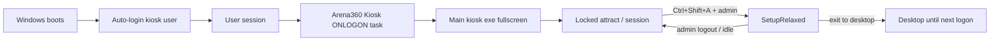

# Windows kiosk deployment — startup, lockdown, and auto-restart

> Part of station deployment — see also [STATION-DEPLOYMENT-GUIDE.md](STATION-DEPLOYMENT-GUIDE.md)
> for the IT fleet checklist covering PC and Android TV stations, and
> [CONSOLE-TV-ANDROID-DEPLOYMENT.md](CONSOLE-TV-ANDROID-DEPLOYMENT.md) for the parallel
> PlayStation Android TV guide.
>
> Operator + engineering guide for running Arena360 kiosk as a true station shell on
> Windows 10/11. Complements [ADR-0020](adr/0020-kiosk-windows-lockdown.md) (in-app
> lockdown) and [apps/kiosk/README.md](../apps/kiosk/README.md) (installer / updates).

## What exists today (K5 + K9)

| Capability | Status | Notes |
|------------|--------|-------|
| Fullscreen + hotkey block (`Locked`) | **Shipped** | Alt+Tab, Win, Ctrl+Esc, etc. ([ADR-0020](adr/0020-kiosk-windows-lockdown.md)) |
| Block window close while locked | **Shipped** | `CloseRequested` → `prevent_close` when `is_locked()` |
| Setup escape (`Ctrl+Shift+A` → admin login) | **Shipped** | `SetupRelaxed` allows close and non-allow-listed launches |
| Windows installer (NSIS `perMachine`) | **Shipped** | [ADR-0028](adr/0028-kiosk-release-pipeline-and-auto-update.md) |
| Idle auto-update | **Shipped** | On registration, setup, and login/attract screens (no active session) |
| Boot auto-start (logon task) | **Shipped** | NSIS post-install `configure-station.ps1` registers **Arena360 Kiosk** at logon (skip with `/NOAUTOSTART`) |
| Auto-reopen after crash/kill | **Not shipped** | Kiosk relaunches on next user logon only ([ADR-0041](adr/0041-remove-watchdog-logon-autostart.md)) |
| Post-install station config | **Shipped** | `configure-station.ps1`: logon task, HKLM hardening, optional auto-logon (skip with `/NOCONFIGURE`) |

**Gap (remaining):** Assigned Access / shell replacement (Layer 1 Options A/B) is still IT manual.
**Exit to desktop** closes the kiosk; it returns on the next user logon (no pause-file IPC).

---

## Target end state



---

## Single-account post-logon provisioning (recommended)

Use **one** Windows account for install, daily player sessions, and in-app operator
setup—the same account that runs the installer (e.g. your venue Administrator login).
No separate `ArenaKiosk` user is required.

**Startup only — Explorer is not replaced.** The recommended path matches Layer 1 **Option C**
(auto-logon optional + **Arena360 Kiosk** scheduled task at logon). `explorer.exe` remains the
Windows shell; the kiosk launches on top after logon. Post-install config does **not** write
`Winlogon\Shell`. Layer 1 Option B (shell replacement) is optional advanced IT manual only.

**Default install directory:** `C:\Program Files\Arena360 Station Management\`

| Step | Who | Action |
|------|-----|--------|
| 1 | IT | Log in as the account that will run the kiosk daily |
| 2 | IT | Run NSIS installer (UAC elevation OK). Silent: `Arena360-setup.exe /S` |
| 3 | Installer | Runs [`configure-station.ps1`](../apps/kiosk/scripts/windows/configure-station.ps1) unless `/NOCONFIGURE` — registers logon task for the installing/console user |
| 4 | IT | Optional: enable auto-logon for that same account (installer prompt, Sysinternals Autologon, or `-AutoLogonPassword` when re-running the script) |
| 5 | Reboot | User logs on (manually or auto-logon) → Arena360 Kiosk task → kiosk fullscreen (`Locked`) |
| 6 | Operator | **RegistrationPage**: sign in with Arena360 admin credentials → name and register device |
| 7 | Operator | **SetupPage** opens automatically (`SetupRelaxed`) → curate software allow-list (no second admin login) |
| 8 | Operator | **Done — re-lock** → player login/attract screen |

First-time device registration runs under **`Locked`** until provisioning completes; the kiosk
then transitions to **`SetupRelaxed`** for allow-list curation. Use setup mode after
registration to install games and edit the allow-list.

### Installer flags

Pass on the NSIS command line (silent: `setup.exe /S`):

| Flag | Effect |
|------|--------|
| `/NOCONFIGURE` | Skip post-install `configure-station.ps1` entirely |
| `/NOAUTOSTART` | Skip kiosk logon scheduled task (still runs script for hardening unless `/NOCONFIGURE`) |
| `/NOHARDENING` | Skip HKLM policy registry keys (`DisableTaskMgr`, etc.) |
| `/KIOSKUSER=Name` | Optional override for logon task user (default: installing/console user) |

### Silent fleet example

```text
# Install while logged in as the account that will run the kiosk:
Arena360-setup.exe /S

# Optional explicit user override (same account, explicit name):
Arena360-setup.exe /S /KIOSKUSER=Administrator

# If autostart failed silently, repair without reinstalling:
powershell -NoProfile -ExecutionPolicy Bypass -File "C:\Program Files\Arena360 Station Management\scripts\verify-station-startup.ps1" -Repair
```

Uninstall removes the **Arena360 Kiosk** task (and legacy **Arena360 Watchdog** if present)
and registry values recorded in `%ProgramData%\Arena360\registry-hardening.json`.

---

## Layer 1 — OS kiosk shell (operator / IT)

Choose **one** primary strategy per venue. All assume a **dedicated local account**
(e.g. `ArenaKiosk`) — not the player's account and not a shared admin account.

### Option A — Assigned Access (recommended for Pro / Enterprise)

Best when you want Microsoft-supported single-app kiosk and can use Entra / local
Assigned Access.

1. Create local user `ArenaKiosk` (no admin rights).
2. Install Arena360 kiosk (`perMachine` NSIS from GitHub Release).
3. **Settings → Accounts → Other users → Set up a kiosk** (or
   `AssignedAccessConfiguration` via PowerShell on build 10.0.22621+).
4. Assign **only** the Arena360 kiosk app as the kiosk app for `ArenaKiosk`.
5. Enable **auto-logon** for `ArenaKiosk` (see § Auto-logon below).
6. Group Policy (optional hardening):
   - `DisableTaskMgr` = Enabled
   - `DisableLockWorkstation` = Enabled
   - `DisableChangePassword` = Enabled

**Pros:** Explorer and Start are not available to the kiosk user.  
**Cons:** Requires Pro/Enterprise; app must be a packaged/registered AUMID or classic
Win32 path depending on Windows build; test on your exact Windows image.

### Option B — Auto-logon + shell replacement (classic gaming-center)

Replace `explorer.exe` with the kiosk for the kiosk user only.

1. Install kiosk to e.g. `C:\Program Files\Arena360\kiosk\Arena360 Station Management.exe`.
2. Auto-logon `ArenaKiosk`.
3. Set per-user shell (run as that user once, or load hive):

   ```reg
   [HKEY_CURRENT_USER\Software\Microsoft\Windows NT\CurrentVersion\Winlogon]
   "Shell"="C:\\Program Files\\Arena360\\kiosk\\Arena360 Station Management.exe"
   ```

4. Keep a **break-glass** admin account; document restoring `"Shell"="explorer.exe"`.

**Pros:** Works on Home/Pro; full-screen shell behavior similar to ggLeap.  
**Cons:** Misconfiguration can brick the desktop session; must test updates and WebView2.

### Option C — Auto-logon + Startup folder / Run key (minimum)

Weakest shell; use only when A/B are not possible.

1. Auto-logon `ArenaKiosk`.
2. Register run-at-logon:

   ```powershell
   $exe = "C:\Program Files\Arena360\kiosk\Arena360 Station Management.exe"
   New-ItemProperty -Path "HKLM:\Software\Microsoft\Windows\CurrentVersion\Run" `
     -Name "Arena360Kiosk" -Value "`"$exe`"" -PropertyType String -Force
   ```

3. Still apply GPO hotkey/task-manager restrictions.

**Pros:** Simple.  
**Cons:** Explorer remains; players can reach desktop until app grabs focus; race at boot.

### Auto-logon (all options)

Use **Sysinternals Autologon** (store password securely) or unattend `AutoLogon` in
`Microsoft-Windows-Shell-Setup`. Never commit passwords to git.

Document for operators: rotate kiosk password when staff leaves; prefer Assigned Access
where available.

---

## Layer 2 — Auto-start at logon (K10 — shipped)

In-app close prevention only applies while `Locked`. **Crash/kill auto-relaunch is not
shipped** ([ADR-0041](adr/0041-remove-watchdog-logon-autostart.md)); the kiosk
returns on the next user logon.

### Shipped: **Arena360 Kiosk** scheduled task

[`configure-station.ps1`](../apps/kiosk/scripts/windows/configure-station.ps1) registers:

| Component | Role |
|-----------|------|
| `Arena360 Station Management.exe` | Main Tauri app — started directly at logon |
| Scheduled task **Arena360 Kiosk** | `ONLOGON` trigger for `-KioskUser` |

**Installer behavior** ([apps/kiosk/src-tauri/windows/hooks.nsh](../apps/kiosk/src-tauri/windows/hooks.nsh)):

1. Registers **`Arena360 Kiosk`** at **logon** for the installing/console Windows user.
2. Deletes legacy **`Arena360 Watchdog`** task if present (migration).
3. Silent opt-out: pass **`/NOAUTOSTART`** to the NSIS installer.
4. In-app updates (`/UPDATE`): refreshes task exe path only via `-RefreshAutostartOnly`.
4. Uninstall removes both task names.

**Single-instance:** the main process acquires `Global\Arena360KioskInstance` mutex at
startup to avoid duplicate instances if the task fires twice.

**Exit to desktop:** closes the kiosk window; desktop remains until the next logon (or manual
launch). No pause file.

### Alternatives (documented, not default)

| Approach | Recovery after kill | Complexity | Notes |
|----------|-------------------|------------|-------|
| ONLOGON task (shipped) | Next logon only | Low | Simple; matches fleet request |
| Watchdog sidecar (removed) | &lt;5 s | Medium | Removed — pause-file reboot failures |
| Windows Service | &lt;5 s | High | Needs ADR if reintroduced |
| HKLM Run key | Next logon only | Low | IT manual; see Layer 1 Option C |

### Integration with lockdown (ADR-0020)

| Event | Behavior |
|-------|----------|
| Normal player session | Stays running until session end or kill |
| `Locked` + Alt+F4 on window | Blocked in-app |
| `SetupRelaxed` + operator closes window | Stays closed until next logon |
| **Exit to desktop** | Closes kiosk; desktop until next logon |
| `restart_station` / `shutdown_station` | OS reboot/shutdown; task starts kiosk after next logon |
| Auto-update relaunch | `tauri-plugin-process` relaunch in-process |

---

## Layer 3 — Fleet rollout

| Step | Owner | Action |
|------|-------|--------|
| 1 | Engineering | Publish signed NSIS + `latest.json` ([kiosk-release.yml](../.github/workflows/kiosk-release.yml)) |
| 2 | IT | Golden image: Windows + GPU drivers + games + WebView2 |
| 3 | IT | Install kiosk while logged in as the station account; optional auto-logon; Assigned Access or shell |
| 4 | Operator | First boot → `Ctrl+Shift+A` → register device, allow-list |
| 5 | IT | GPO export for `DisableTaskMgr`, firewall, Windows Update window |
| 6 | Engineering | Installer registers logon task; optional `/NOAUTOSTART`; updates refresh task path only |

**SCCM / Intune:** Deploy NSIS silently (`/S`) while the target user is logged in, or pass
`/KIOSKUSER=` with the station account name. If autostart fails, run
`verify-station-startup.ps1 -Repair` (bundled under install dir).

---

## Roadmap (PLANNER phase K10)

| Task ID | Title | Priority | Delivers |
|---------|-------|----------|----------|
| `kiosk-deploy-guide` | Operator deployment guide + GPO checklist | Should | This doc + README link; PowerShell samples |
| `kiosk-startup-task` | NSIS logon scheduled task at logon | Should | **Done** — `hooks.nsh`; `/NOAUTOSTART` opt-out |
| `kiosk-watchdog` | Watchdog sidecar + pause file + mutex | Should | **Removed** — [ADR-0041](adr/0041-remove-watchdog-logon-autostart.md) |
| `kiosk-installer-fleet` | Silent install + `configure-station.ps1` | Should | **Done** — bundled in NSIS; `/NOCONFIGURE` opt-out |
| `kiosk-deploy-adr` | DRAFT ADR only if Windows Service chosen | Conditional | Per [20-adr-discipline](../.cursor/rules/20-adr-discipline.mdc) |

**Suggested order:** `kiosk-deploy-guide` (done — this file) → `kiosk-startup-task` →
`kiosk-installer-fleet`.

**No ADR required** for Run-key + sidecar exe in the same installer (same deployment unit
as ADR-0028). Draft ADR if adding a privileged Windows Service or shell-wide policy agent.

---

## Troubleshooting autostart

If the kiosk does not appear after reboot:

1. Wait **30 seconds** after the desktop appears (logon task has a built-in delay).
2. Run the bundled diagnostic (elevated PowerShell — install path is auto-detected):

   ```powershell
   & "C:\Program Files\Arena360 Station Management\scripts\verify-station-startup.ps1"
   ```

3. Repair in one step:

   ```powershell
   & "C:\Program Files\Arena360 Station Management\scripts\verify-station-startup.ps1" -Repair
   ```

   This re-registers the **Arena360 Kiosk** ONLOGON task for the installing/console user.

4. Reboot and confirm the kiosk launches without manual start (QA checklist items 18–19).

Common causes: silent install deployed as `SYSTEM` with no console user logged in, silent install with `/NOAUTOSTART`, or stale task action path after a manual move. **In-app updates** refresh only the task exe path (`/UPDATE`); they do not re-run hardening or auto-logon. Fresh installs and `-Repair` run full `configure-station.ps1`.

---

## Manual setup now (fallback)

Use this only when the NSIS installer cannot run post-install configuration (e.g. `/NOCONFIGURE`).
Fresh installs from GitHub Releases run [`configure-station.ps1`](../apps/kiosk/scripts/windows/configure-station.ps1)
automatically unless `/NOCONFIGURE` is passed.

1. Install kiosk from the latest GitHub Release.
2. Log in as the Windows account that will run the kiosk; run configure script manually if `/NOCONFIGURE` was used.
3. Pick Option A, B, or C above for shell.
4. Create a Scheduled Task (run as the installing user, interactive):

   - **Trigger:** At log on
   - **Action:** Start `Arena360 Station Management.exe` from the install directory
   - **Settings:** If the task fails, restart every 1 minute; stop if running &gt; 1 day

5. For faster recovery, add a second task every 5 minutes:

   ```powershell
   $exeName = "Arena360 Station Management"
   if (-not (Get-Process -Name $exeName -ErrorAction SilentlyContinue)) {
     Start-Process "C:\Program Files\Arena360 Station Management\Arena360 Station Management.exe"
   }
   ```

6. Test: kill the process from Task Manager (setup mode) — confirm relaunch within 1 min.
7. Test: `Ctrl+Shift+A` setup logout — confirm lockdown returns.

---

## Requirements traceability

| Story | Description | Phase |
|-------|-------------|-------|
| US-KDEPLOY-001 | Dedicated kiosk Windows account + auto-logon documented | K10 |
| US-KDEPLOY-002 | App launches automatically at user logon | K10 (`kiosk-startup-task`) |
| US-KDEPLOY-003 | If kiosk exits unexpectedly, relaunch within 10 s | K10 (`kiosk-watchdog`) |
| US-KDEPLOY-004 | Intentional operator exit does not fight watchdog | K10 (`kiosk-watchdog` pause) |
| US-KDEPLOY-005 | OS-level hardening checklist (Assigned Access / GPO) | K10 (this guide) |

See [REQUIREMENTS-KIOSK.md](REQUIREMENTS-KIOSK.md) §4.10 and §6.6.

---

## Risks

| Risk | Mitigation |
|------|------------|
| Wrong user bound to logon task during SCCM deploy | Install while target user is logged in; script resolves console user; use `/KIOSKUSER=` override |
| Duplicate instances at boot | Single-instance mutex in kiosk ([ADR-0041](adr/0041-remove-watchdog-logon-autostart.md)) |
| Shell replacement breaks Windows servicing | Break-glass admin account; document registry restore |
| perMachine update UAC | Updater gated to idle phases; `prepare_for_update` clears legacy pause files ([ADR-0028](adr/0028-kiosk-release-pipeline-and-auto-update.md)) |

---

## References

- [ADR-0020: Windows lockdown](adr/0020-kiosk-windows-lockdown.md)
- [ADR-0028: Release + auto-update](adr/0028-kiosk-release-pipeline-and-auto-update.md)
- [PLANNER-KIOSK.md — K10](PLANNER-KIOSK.md)
- [Microsoft — Set up a kiosk](https://learn.microsoft.com/en-us/windows/configuration/kiosk-setting-up)
- [Microsoft — Assigned Access](https://learn.microsoft.com/en-us/windows/configuration/assigned-access/)
