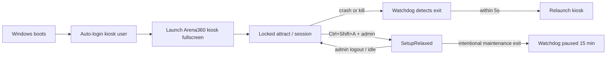

# Windows kiosk deployment — startup, lockdown, and auto-restart

> Part of station deployment — see also [STATION-DEPLOYMENT-GUIDE.md](STATION-DEPLOYMENT-GUIDE.md)
> for the IT fleet checklist covering PC and Android TV stations, and
> [CONSOLE-TV-ANDROID-DEPLOYMENT.md](CONSOLE-TV-ANDROID-DEPLOYMENT.md) for the parallel
> PlayStation Android TV guide.
>
> Operator + engineering guide for running Arena360 kiosk as a true station shell on
> Windows 10/11. Complements [ADR-0020](adr/0020-kiosk-windows-lockdown.md) (in-app
> lockdown) and [apps/kiosk/README.md](../apps/kiosk/README.md) (installer / updates).

## What exists today (K5 + K9)

| Capability | Status | Notes |
|------------|--------|-------|
| Fullscreen + hotkey block (`Locked`) | **Shipped** | Alt+Tab, Win, Ctrl+Esc, etc. ([ADR-0020](adr/0020-kiosk-windows-lockdown.md)) |
| Block window close while locked | **Shipped** | `CloseRequested` → `prevent_close` when `is_locked()` |
| Setup escape (`Ctrl+Shift+A` → admin login) | **Shipped** | `SetupRelaxed` allows close and non-allow-listed launches |
| Windows installer (NSIS `perMachine`) | **Shipped** | [ADR-0028](adr/0028-kiosk-release-pipeline-and-auto-update.md) |
| Idle auto-update | **Shipped** | Only on login/attract screen, no active session |
| Boot auto-start (watchdog) | **Shipped** | NSIS registers `Arena360 Watchdog` scheduled task at logon (skip with `/NOAUTOSTART`) |
| Auto-reopen after crash/kill | **Shipped** | `arena360-watchdog.exe` sidecar polls every 2 s and relaunches kiosk |

**Gap (remaining):** OS shell hardening (Assigned Access / GPO) is still IT manual.
`SetupRelaxed` close and **Exit to desktop (15 min)** write a pause file so the watchdog
does not relaunch until the TTL expires. Power restart/shutdown and auto-update handoff
also pause the watchdog briefly.

---

## Target end state



---

## Layer 1 — OS kiosk shell (operator / IT)

Choose **one** primary strategy per venue. All assume a **dedicated local account**
(e.g. `ArenaKiosk`) — not the player's account and not a shared admin account.

### Option A — Assigned Access (recommended for Pro / Enterprise)

Best when you want Microsoft-supported single-app kiosk and can use Entra / local
Assigned Access.

1. Create local user `ArenaKiosk` (no admin rights).
2. Install Arena360 kiosk (`perMachine` NSIS from GitHub Release).
3. **Settings → Accounts → Other users → Set up a kiosk** (or
   `AssignedAccessConfiguration` via PowerShell on build 10.0.22621+).
4. Assign **only** the Arena360 kiosk app as the kiosk app for `ArenaKiosk`.
5. Enable **auto-logon** for `ArenaKiosk` (see § Auto-logon below).
6. Group Policy (optional hardening):
   - `DisableTaskMgr` = Enabled
   - `DisableLockWorkstation` = Enabled
   - `DisableChangePassword` = Enabled

**Pros:** Explorer and Start are not available to the kiosk user.  
**Cons:** Requires Pro/Enterprise; app must be a packaged/registered AUMID or classic
Win32 path depending on Windows build; test on your exact Windows image.

### Option B — Auto-logon + shell replacement (classic gaming-center)

Replace `explorer.exe` with the kiosk for the kiosk user only.

1. Install kiosk to e.g. `C:\Program Files\Arena360\kiosk\Arena360 Kiosk.exe`.
2. Auto-logon `ArenaKiosk`.
3. Set per-user shell (run as that user once, or load hive):

   ```reg
   [HKEY_CURRENT_USER\Software\Microsoft\Windows NT\CurrentVersion\Winlogon]
   "Shell"="C:\\Program Files\\Arena360\\kiosk\\Arena360 Kiosk.exe"
   ```

4. Keep a **break-glass** admin account; document restoring `"Shell"="explorer.exe"`.

**Pros:** Works on Home/Pro; full-screen shell behavior similar to ggLeap.  
**Cons:** Misconfiguration can brick the desktop session; must test updates and WebView2.

### Option C — Auto-logon + Startup folder / Run key (minimum)

Weakest shell; use only when A/B are not possible.

1. Auto-logon `ArenaKiosk`.
2. Register run-at-logon:

   ```powershell
   $exe = "C:\Program Files\Arena360\kiosk\Arena360 Kiosk.exe"
   New-ItemProperty -Path "HKLM:\Software\Microsoft\Windows\CurrentVersion\Run" `
     -Name "Arena360Kiosk" -Value "`"$exe`"" -PropertyType String -Force
   ```

3. Still apply GPO hotkey/task-manager restrictions.

**Pros:** Simple.  
**Cons:** Explorer remains; players can reach desktop until app grabs focus; race at boot.

### Auto-logon (all options)

Use **Sysinternals Autologon** (store password securely) or unattend `AutoLogon` in
`Microsoft-Windows-Shell-Setup`. Never commit passwords to git.

Document for operators: rotate kiosk password when staff leaves; prefer Assigned Access
where available.

---

## Layer 2 — Auto-restart when the app closes (K10 — shipped)

In-app close prevention only applies while `Locked`. The **watchdog sidecar** recovers
from crashes and kills.

### Shipped: `arena360-watchdog.exe` (K10.2)

Installed next to the kiosk binary by NSIS (`bundle.externalBin`):

| Component | Role |
|-----------|------|
| `Arena360 Station Management.exe` | Main Tauri app |
| `arena360-watchdog.exe` | Sidecar; no UI; polls every 2 s |

**Installer behavior** ([apps/kiosk/src-tauri/windows/hooks.nsh](../apps/kiosk/src-tauri/windows/hooks.nsh)):

1. Registers scheduled task **`Arena360 Watchdog`** at **logon** for the installing user
   (run the installer logged in as `ArenaKiosk` when possible).
2. Silent opt-out: pass **`/NOAUTOSTART`** to the NSIS installer.
3. Uninstall removes the task and `%ProgramData%\Arena360\watchdog.pause`.

**Watchdog loop:**

1. If `%ProgramData%\Arena360\watchdog.pause` is valid → do not relaunch.
2. If kiosk process missing and `Global\Arena360KioskInstance` mutex not held → spawn kiosk.
3. Debounce spawns by 3 s to avoid tight crash loops.

**Pause file** (JSON):

```json
{"until":"2026-06-15T12:00:00Z","reason":"setup"}
```

Written automatically when:

- Lockdown enters `SetupRelaxed` (15 min, `reason: setup`)
- Operator clicks **Exit to desktop (15 min)** in setup (`reason: maintenance`)
- Auto-update relaunch (30 s, `reason: update`)
- Restart/shutdown from setup (`reason: power`)

Cleared when lockdown returns to `Locked`.

### Original design notes (still valid)

Ship a second small binary next to the kiosk (same NSIS install):

| Component | Role |
|-----------|------|
| `arena360-kiosk.exe` | Main Tauri app (unchanged) |
| `arena360-watchdog.exe` | Rust or PowerShell-compiled helper; no UI |

**Behavior:**

1. Installer registers watchdog as a **Scheduled Task**:
   - Trigger: **At logon** (kiosk user) + **On failure** every 1 min (backup).
   - Action: start watchdog if not running.
2. Watchdog loop (every 2 s):
   - If main process not running **and** pause file absent → spawn kiosk.
   - Single-instance mutex prevents duplicate kiosks.
3. **Admin pause:** When operator exits setup with “Exit to desktop” (future UI) or
   creates `%ProgramData%\Arena360\watchdog.pause` with TTL 15 min, watchdog does not
   relaunch.
4. **Setup maintenance:** `SetupRelaxed` sets pause via IPC to watchdog (optional K10.3).

**Why not only a Scheduled Task polling the exe?**  
Works for MVP (K10.1), but 60 s gaps are unacceptable on a public station. Sidecar gives
sub-5 s recovery.

### Alternatives (documented, not default)

| Approach | Recovery time | Complexity | Notes |
|----------|---------------|------------|-------|
| Scheduled Task “if not running” | 30–60 s | Low | Good for K10.1 MVP |
| Windows Service | &lt;5 s | High | Needs ADR if separate service install |
| Task Scheduler on process exit | N/A | — | Windows has no reliable “on process exit” trigger for arbitrary exe |
| `tauri-plugin-single-instance` only | None | Low | Prevents duplicates; does not restart |

### Integration with lockdown (ADR-0020)

| Event | Watchdog |
|-------|----------|
| Normal player session | Relaunch if killed |
| `Locked` + Alt+F4 on window | Blocked in-app; no restart needed |
| `SetupRelaxed` + operator closes window | **Do not** restart until pause expires or new logon |
| `restart_station` / `shutdown_station` | Watchdog must honor pause file or exit code `--maintenance` |
| Auto-update relaunch | `tauri-plugin-process` relaunch; watchdog should treat as healthy handoff (same mutex) |

---

## Layer 3 — Fleet rollout

| Step | Owner | Action |
|------|-------|--------|
| 1 | Engineering | Publish signed NSIS + `latest.json` ([kiosk-release.yml](../.github/workflows/kiosk-release.yml)) |
| 2 | IT | Golden image: Windows + GPU drivers + games + WebView2 |
| 3 | IT | Create `ArenaKiosk` user, auto-logon, Assigned Access or shell |
| 4 | Operator | First boot → `Ctrl+Shift+A` → register device, allow-list |
| 5 | IT | GPO export for `DisableTaskMgr`, firewall, Windows Update window |
| 6 | Engineering (K10) | Installer registers watchdog task; optional `/NOAUTOSTART` |

**SCCM / Intune:** Deploy MSI/NSIS silently (`/S`), then run bundled
`scripts/windows/configure-station.ps1` (K10.1) with parameters for shell mode.

---

## Roadmap (PLANNER phase K10)

| Task ID | Title | Priority | Delivers |
|---------|-------|----------|----------|
| `kiosk-deploy-guide` | Operator deployment guide + GPO checklist | Should | This doc + README link; PowerShell samples |
| `kiosk-startup-task` | NSIS watchdog scheduled task at logon | Should | **Done** — `hooks.nsh`; `/NOAUTOSTART` opt-out |
| `kiosk-watchdog` | Watchdog sidecar + pause file + mutex | Should | **Done** — `arena360-watchdog.exe` |
| `kiosk-installer-fleet` | Silent install + `configure-station.ps1` | Could | SCCM/Intune one-liner |
| `kiosk-deploy-adr` | DRAFT ADR only if Windows Service chosen | Conditional | Per [20-adr-discipline](../.cursor/rules/20-adr-discipline.mdc) |

**Suggested order:** `kiosk-deploy-guide` (done — this file) → `kiosk-startup-task` →
`kiosk-watchdog` → `kiosk-installer-fleet`.

**No ADR required** for Run-key + sidecar exe in the same installer (same deployment unit
as ADR-0028). Draft ADR if adding a privileged Windows Service or shell-wide policy agent.

---

## Manual setup now (fallback)

Use this only when the NSIS installer cannot register the watchdog task (e.g. silent
deploy without logon task permissions). Fresh installs from GitHub Releases register the
task automatically unless `/NOAUTOSTART` is passed.

1. Install kiosk from the latest GitHub Release.
2. Create `ArenaKiosk` user; enable auto-logon.
3. Pick Option A, B, or C above for shell.
4. Create a Scheduled Task (run as `ArenaKiosk`, highest available):

   - **Trigger:** At log on
   - **Action:** Start `Arena360 Kiosk.exe`
   - **Settings:** If the task fails, restart every 1 minute; stop if running &gt; 1 day

5. For faster recovery, add a second task every 5 minutes:

   ```powershell
   $name = "Arena360 Kiosk"
   if (-not (Get-Process -Name $name -ErrorAction SilentlyContinue)) {
     Start-Process "C:\Program Files\Arena360\kiosk\Arena360 Kiosk.exe"
   }
   ```

6. Test: kill the process from Task Manager (setup mode) — confirm relaunch within 1 min.
7. Test: `Ctrl+Shift+A` setup logout — confirm lockdown returns.

---

## Requirements traceability

| Story | Description | Phase |
|-------|-------------|-------|
| US-KDEPLOY-001 | Dedicated kiosk Windows account + auto-logon documented | K10 |
| US-KDEPLOY-002 | App launches automatically at user logon | K10 (`kiosk-startup-task`) |
| US-KDEPLOY-003 | If kiosk exits unexpectedly, relaunch within 10 s | K10 (`kiosk-watchdog`) |
| US-KDEPLOY-004 | Intentional operator exit does not fight watchdog | K10 (`kiosk-watchdog` pause) |
| US-KDEPLOY-005 | OS-level hardening checklist (Assigned Access / GPO) | K10 (this guide) |

See [REQUIREMENTS-KIOSK.md](REQUIREMENTS-KIOSK.md) §4.10 and §6.6.

---

## Risks

| Risk | Mitigation |
|------|------------|
| Watchdog relaunch during Windows Update reboot | Pause file before maintenance; task only runs at kiosk user logon |
| Duplicate instances at boot | Single-instance mutex in kiosk + watchdog |
| SmartScreen blocks watchdog | Same Authenticode cert as main binary |
| Shell replacement breaks Windows servicing | Break-glass admin account; document registry restore |
| perMachine update UAC | Run watchdog/kiosk as kiosk user; updater already gated to idle ([ADR-0028](adr/0028-kiosk-release-pipeline-and-auto-update.md)) |

---

## References

- [ADR-0020: Windows lockdown](adr/0020-kiosk-windows-lockdown.md)
- [ADR-0028: Release + auto-update](adr/0028-kiosk-release-pipeline-and-auto-update.md)
- [PLANNER-KIOSK.md — K10](PLANNER-KIOSK.md)
- [Microsoft — Set up a kiosk](https://learn.microsoft.com/en-us/windows/configuration/kiosk-setting-up)
- [Microsoft — Assigned Access](https://learn.microsoft.com/en-us/windows/configuration/assigned-access/)
