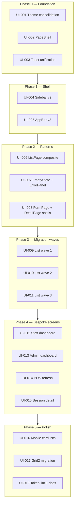

# PLAN: Admin UI Modernization

> Living implementation plan for a modern, cohesive admin experience.
> Complements the completed [UX gap fixes](.cursor/plans/admin_ux_gap_analysis_6b47e72b.plan.md)
> (functional trust/flow work) with visual system, shell, and page-pattern work.
>
> Last updated: 2026-06-07

## Quick links

- Requirements (stakeholders): [REQUIREMENTS.md](REQUIREMENTS.md)
- Design tokens ADR: [adr/0007-design-tokens-shared.md](adr/0007-design-tokens-shared.md)
- Task tracker: [TASKS-ADMIN-UI-MODERNIZATION.md](TASKS-ADMIN-UI-MODERNIZATION.md)
- Shell ADR (proposed): [adr/DRAFT-0034-admin-shell-v2.md](adr/DRAFT-0034-admin-shell-v2.md)
- Shared UI: `packages/ui`
- Shared theme: `packages/theme`
- Admin app: `apps/admin`

## Status legend

| Status | Meaning |
|--------|---------|
| `pending` | Not started |
| `in_progress` | Active work |
| `blocked` | Waiting on another task or decision |
| `done` | Acceptance criteria met |
| `verified` | Done + visual/regression check passed |

---

## Overview

### Problem

The admin app is functionally solid after recent journey and UX fixes, but it
still reads as a generic MUI admin panel:

- Production theme comes from legacy `packages/theme/src/lib/theme.ts`, not the
  token-driven `mui-theme.ts` described in ADR-0007.
- ~52 pages repeat layout, padding, and list logic with inline `sx`.
- Login uses a dark cinematic shell; the dashboard is flat light gray — weak
  brand continuity.
- High-traffic counter flows (sessions, POS, plan sales) lack a unified visual
  language.

### Goal

Deliver a **counter-first, owner-clear** modern UI:

| Audience | Outcome |
|----------|---------|
| Floor staff | Large tap targets, one-glance status, ≤2 taps to core actions |
| Owners | Clean analytics, semantic colors, consistent hierarchy |
| Brand | Arena360 orange + navy; aligned with kiosk without a full dark dashboard |

### Non-goals (this plan)

- Backend or API changes
- New component library (stay MUI v7 + `@gaming-cafe/theme`)
- Full dark-mode dashboard (backlog only)
- Workflow redesign (flows were just fixed in UX gap plan)
- Kiosk UI rewrite

### ADR impact

Work stays within **ADR-0007** (shared tokens, MUI theme from tokens). Draft an
ADR only if token semantics change or a new UI dependency is introduced (e.g.
MUI X DataGrid).

---

## Design direction

### Visual rules

| Element | Target |
|---------|--------|
| Page background | `surface-alt` with white cards, soft border or `shadow-sm` |
| Radius | `tokens.radius.md` (12px) on cards, inputs, dialogs |
| Typography | Page title: `h5` semibold; sections: `subtitle1`; meta: `caption` muted |
| Tables | Softer headers, optional zebra, sticky header on long lists |
| Staff CTAs | Min 44px height, icon + label, primary row on staff dashboard |
| Status chips | Semantic palette only (`success`, `warning`, `danger`, `info`) — no raw hex |
| Spacing | `PageShell`: `px: { xs: 2, md: 4 }`, `py: { xs: 2, md: 3 }` |
| Motion | 150–200ms transitions; respect `prefers-reduced-motion` |

### Architecture (target)



---

## Milestones

### Milestone M1 — Foundation (Target: +1 sprint)

**Goal:** Single theme source, shared page wrapper, unified feedback.

| Task | Title |
|------|-------|
| UI-001 | Consolidate MUI theme onto tokens |
| UI-002 | `PageShell` primitive |
| UI-003 | Unify toast API and styling |
| UI-004 | Semantic stat colors (`StatCard`) |

**Exit criteria:** Five pilot pages use `PageShell`; no new hardcoded metric hex in pilots.

---

### Milestone M2 — App shell (Target: +1 sprint)

**Goal:** Navigation and chrome feel intentional.

| Task | Title |
|------|-------|
| UI-005 | Sidebar v2 |
| UI-006 | AppBar v2 (contextual title, shift badge) |
| UI-007 | Nav grouping for rush-hour vs config |

**Exit criteria:** Collapsed sidebar shows flyout for child routes; AppBar shows route title.

---

### Milestone M3 — Page pattern library (Target: +1–2 sprints)

**Goal:** 80% of pages can adopt typed templates.

| Task | Title |
|------|-------|
| UI-008 | `ListPage` composite |
| UI-009 | `FormPage` shell |
| UI-010 | `DetailPage` shell |
| UI-011 | `EmptyState` + `ErrorPanel` + loading kit |

**Exit criteria:** Pattern components exported from `@gaming-cafe/ui`; Storybook or README examples.

---

### Milestone M4 — List migration (Target: +2 sprints)

**Goal:** High-traffic lists share modern skeleton.

| Wave | Tasks | Pages |
|------|-------|-------|
| Wave 1 | UI-012 | Sessions, Players, Plan sales, POS sales |
| Wave 2 | UI-013 | Shifts, Cash registers, Cash deposits |
| Wave 3 | UI-014 | Products, Plans, Devices, Games, Inventory, Expenses, Vendors |

**Exit criteria:** Each wave page uses `ListPage`; filters and pagination preserved.

---

### Milestone M5 — Bespoke screens (Target: +2 sprints)

**Goal:** Counter-critical screens get dedicated modern layouts.

| Task | Title |
|------|-------|
| UI-015 | Staff dashboard visual refresh |
| UI-016 | Admin dashboard visual refresh |
| UI-017 | POS (`ProductTransactionNewPage`) refresh |
| UI-018 | Session detail refresh |
| UI-019 | Shift handover dialog polish |

**Exit criteria:** Staff can complete shift loop without horizontal scroll at 375px.

---

### Milestone M6 — Polish (Target: +1 sprint)

| Task | Title |
|------|-------|
| UI-020 | Mobile card-list fallback (sessions) |
| UI-021 | `GridLegacy` → `Grid2` migration |
| UI-022 | `packages/ui` pattern documentation |
| UI-023 | Visual regression checklist (375 / 768 / 1280) |

---

## Dependency graph

```
UI-001 ──┬──► UI-002 ──┬──► UI-008 ──► UI-012 ──► UI-013 ──► UI-014
         │             │
         ├──► UI-003   ├──► UI-009, UI-010
         └──► UI-004   └──► UI-011
UI-005 ──► UI-006 ──► UI-007
UI-008 + UI-011 ──► UI-015, UI-016, UI-017, UI-018
UI-012 ──► UI-020
```

---

## Open decisions (blockers until resolved)

| # | Question | Options | Recommendation |
|---|----------|---------|----------------|
| D1 | Dashboard density | Comfortable vs compact tables | Comfortable for staff; compact toggle for owner lists (backlog) |
| D2 | Sidebar style | Navy dark (current) vs light sidebar | Keep navy sidebar; lighten content cards |
| D3 | Empty states | Icon-only vs illustrations | Icon + headline + CTA (no custom art in M1–M5) |
| D4 | POS priority | Phase 4 default vs bump to M3 | Keep in M5 unless staff feedback says POS is most dated |

---

## Risk register

| Risk | Likelihood | Impact | Mitigation |
|------|------------|--------|------------|
| Theme merge breaks kiosk/admin parity | Medium | High | Visual diff login + 3 list pages before wide rollout |
| PageShell migration churn | Medium | Medium | Pilot 5 pages; migrate in waves |
| POS rewrite scope creep | High | High | Visual-only pass; no cart logic changes |
| Grid2 migration regressions | Low | Medium | One file per PR |
| Staff disruption during rush | Medium | High | Ship shell changes off-peak; feature-flag optional |

---

## Success metrics

| Metric | Target |
|--------|--------|
| Theme source | Single `mui-theme.ts` path in `Providers` |
| Page consistency | ≥90% routes on `PageShell` or typed template |
| Staff taps to core action | ≤2 from staff dashboard |
| Hardcoded hex in admin pages | 0 new instances; existing removed from dashboards |
| Responsive | No broken layouts at 375px, 768px, 1280px |
| Build | `pnpm typecheck` + Biome clean on touched packages |

---

## Pilot pages (use for every milestone gate)

1. `apps/admin/src/pages/dashboard/sessions/SessionsPage.tsx`
2. `apps/admin/src/pages/dashboard/StaffDashboardView.tsx`
3. `apps/admin/src/pages/dashboard/plan-transactions/PlanTransactionsPage.tsx`
4. `apps/admin/src/pages/dashboard/sessions/SessionDetailPage.tsx`
5. `apps/admin/src/pages/auth/LoginPage.tsx`

---

## Suggested sprint order

| Sprint | Focus | Tasks |
|--------|-------|-------|
| 1 | Foundation | UI-001, UI-002, UI-003, UI-004 |
| 2 | Shell | UI-005, UI-006, UI-007 |
| 3 | Patterns | UI-008, UI-009, UI-010, UI-011 |
| 4 | List wave 1 + staff dashboard | UI-012, UI-015 |
| 5 | List wave 2 + admin dashboard | UI-013, UI-016 |
| 6 | POS + session detail | UI-017, UI-018, UI-019 |
| 7 | List wave 3 + polish | UI-014, UI-020, UI-021, UI-022, UI-023 |

**Estimated total:** 7 sprints (adjust if parallelizing `packages/ui` and `apps/admin`).

---

## References

- ADR-0007: Shared design tokens
- ADR-0006: Biome only (no ESLint/Prettier)
- UX gap plan (completed): functional fixes — filters, TOTP, shift guards, CTAs
- Central files: `packages/theme/src/mui-theme.ts`, `packages/ui/src/lib/components/*`,
  `apps/admin/src/components/PageHeader.tsx`
