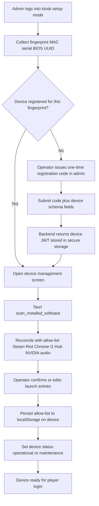
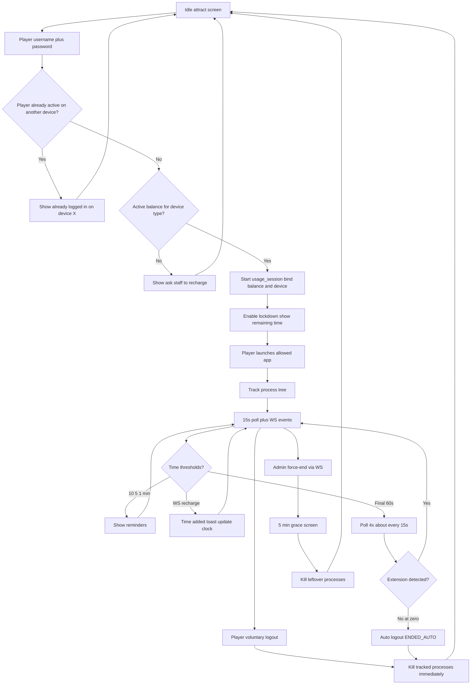

# REQUIREMENTS: Arena360 Kiosk (Tauri)

> Product requirements for the in-cafe Windows kiosk application.
> Companion to [REQUIREMENTS.md](./REQUIREMENTS.md) (platform-wide).
> Last updated: 2026-06-07.

## Document control

| Field | Value |
|-------|-------|
| **Surface** | `apps/kiosk` (Tauri 2 + React 19 + Rust `src-tauri/`) |
| **Platform v1** | Windows 10/11 only |
| **Alignment** | ggLeap-style gaming-center kiosk (session lockdown, launcher, live time) |
| **Supersedes** | Skeletal `US-KIOSK-001..008` and session stories in `REQUIREMENTS.md` for kiosk-specific detail |
| **Status** | Requirements only — no implementation in this document |
| **Implementation tracker** | [PLANNER-KIOSK.md](PLANNER-KIOSK.md) |

---

## 1. Overview & scope

### 1.1 Purpose

The **Arena360 kiosk** is a full-screen desktop agent installed on each gaming PC. It:

1. **Registers** the physical machine with the backend using a hardware fingerprint and operator-issued code.
2. **Onboards** the device (software scan, launch allow-list, status) under operator control.
3. **Authenticates** walk-in players with username + password.
4. **Runs** timed gaming sessions against `player_plan_balances` (minutes wallet).
5. **Enforces** OS lockdown so players can only launch operator-approved applications.
6. **Synchronizes** remaining time via REST polling and WebSocket push when staff recharge at the counter.
7. **Cleans up** launched processes on session end (immediate on normal logout; grace on force-end).

Players interact **only** with the kiosk. Staff and the owner use `apps/admin`. The Rust Axum backend (`apps/backend`) is the source of truth.

### 1.2 ggLeap alignment

This PRD targets **functional parity with ggLeap’s core in-cafe experience** (station lockdown, member login, time display, launcher, staff-driven top-up, session end), not every ggLeap module. See [§9 ggLeap parity matrix](#9-ggleap-parity-matrix).

### 1.3 Confirmed scope decisions (v1)

| Topic | Decision |
|-------|----------|
| **OS** | Windows only — lockdown, process supervision, and software scan are Windows-first |
| **Player auth** | Username + password (accounts created by staff/admin) |
| **Recharge** | Staff/counter only; kiosk listens on WebSocket `device:{id}` and updates remaining time live |
| **Device identity** | Composite fingerprint: primary NIC MAC + machine serial + motherboard/BIOS UUID |
| **Hardware drift** | Tolerate change of **one** fingerprint component; if **two or more** change, require re-registration |
| **Normal logout** | Kill all session-tracked processes **immediately** |
| **Force-end** | Admin/staff force-end → **5-minute grace**, then kill leftover tracked processes |
| **Reminders** | 10 min, 5 min, and 1 min remaining; plus “time added” toast on any WS recharge |
| **Final minute** | Poll backend **4 times** (~every 15 s); if extension/recharge detected, stay logged in; else auto-logout at 0 |
| **Member module** | Profile + balances + session/transaction history (read-only); no loyalty points/redemption |
| **Baseline poll** | Every **15 s** while session active (`US-SESSION-004`) |
| **Single login** | One active kiosk session per player account at a time — no simultaneous logins on multiple devices (`US-KAUTH-006`) |
| **Setup lockdown** | Admin/staff login in setup mode **disables** kiosk lockdown; logout, idle timeout, or player session start **re-enables** it (`US-KLOCK-005`) |

### 1.4 In scope (v1)

- Device onboarding journey (operator at machine → registration → software curation → ready for customer)
- Player session journey (login → balance check → session → launch → countdown → end → cleanup)
- Windows kiosk-mode lockdown (hotkeys, task switcher, shell escape)
- Local software discovery (Steam, Riot, common game folders, Chrome, Logitech G Hub, NVIDIA Control Panel, audio utilities)
- Process tracking and termination for launched apps
- Prominent remaining-time UI and low-time warnings
- WebSocket-driven live time updates after staff recharge
- Offline grace for **active** sessions only
- Member profile screen (balances, history)
- Single active session per player — block login on a second device while already in session elsewhere

### 1.5 Out of scope (v1 — Won’t)

| Area | Notes |
|------|-------|
| In-kiosk store / self top-up / online payment on kiosk | Recharge is staff/counter only |
| Reservations / pre-booking stations | Future |
| Loyalty points, tiers, rewards redemption | Member view is informational only |
| Leaderboards, friends, social | Future |
| Cross-platform kiosk (Linux, macOS) | Windows-only v1 |
| QR / RFID / card login | Username + password only |
| Games catalog in backend | `games` / `device_games` removed per migration; launcher is local allow-list |
| Multi-tenant / multi-cafe SaaS | Single cafe per deployment |

---

## 2. Stakeholders & actors

### 2.1 Primary

| Actor | Role | Touchpoints |
|-------|------|-------------|
| **Player** | Pays for plan time, uses gaming PC | Kiosk UI: login, launcher, timer, member view, voluntary logout |
| **Cafe staff / operator** | Onboards devices, sells/recharges plans, sets device status | Admin SPA + physical access at kiosk for onboarding |
| **Kiosk device agent** | Tauri app on each PC | Rust core: lockdown, scan, process supervision; React UI; device JWT |

### 2.2 System actors

| Actor | Role |
|-------|------|
| **Arena360 backend** | Auth, devices, balances, sessions, realtime outbox, OpenAPI |
| **Admin SPA** | Device CRUD, registration codes, force-end session, status (maintenance, etc.) |
| **WebSocket hub** | `GET /realtime` — channels `device:{uuid}`, `staff`, `user:{uuid}` |

### 2.3 Out of audience

- Public web customers (no browser portal)
- Players on unmanaged PCs (kiosk is mandatory on gaming stations)

---

## 3. User journeys

### 3.1 Device onboarding journey (operator)

**Goal:** Machine is registered, fingerprint-bound, software curated, and marked ready for players.



**Steps (narrative):**

1. **Setup mode** — Operator authenticates on the kiosk with **admin credentials** (separate from player login; not exposed on idle player screen).
2. **Fingerprint** — Kiosk collects MAC (primary active adapter), Windows machine serial, motherboard/BIOS UUID via Rust commands.
3. **Registration check** — If fingerprint matches a registered device → skip code exchange; else require one-time code.
4. **Device record** — On first registration, create/link `devices` row: `name`, `serialNumber`, `localIpAddress`, `deviceType`, `location`, `status`, `registeredKiosk` (fingerprint payload), `registrationStatus = registered`.
5. **Software scan** — Auto-detect launchers and utilities; operator curates what players may launch.
6. **Status** — Operator or admin sets `operational`, `under_maintenance`, or `out_of_service` (see device schema). Kiosk refuses player login when not operational/available.
7. **Ready** — Idle player attract screen; device polls health and listens for admin status changes via WS.

### 3.2 Player session journey

**Goal:** Player uses prepaid minutes safely under lockdown; time stays accurate through recharge and auto-end.



---

## 4. Functional requirements

IDs follow `US-K<AREA>-<NNN>`. Priority: **Must** / **Should** / **Could** / **Won’t**.

Legacy platform IDs (`US-KIOSK-*`, `US-SESSION-*`, `US-AUTH-003`) map to these epics where noted.

### 4.1 Device registration & identity — `US-KREG-*`

| ID | Story | Priority | Maps from |
|----|-------|----------|-----------|
| US-KREG-001 | As a freshly installed kiosk, I want to exchange an operator-issued one-time registration code for a device JWT stored in Tauri secure storage, so every API call is authenticated as this machine. | Must | US-KIOSK-001 |
| US-KREG-002 | As the kiosk, I want to compute and report a composite hardware fingerprint (MAC + serial + BIOS UUID), so the backend can detect clone or hardware swap. | Must | — |
| US-KREG-003 | As the backend, I want to accept registration when at most one fingerprint component changed since last registration, and reject when two or more changed, so stolen disks cannot silently re-bind. | Must | — |
| US-KREG-004 | As the kiosk, I want to detect that I am already registered for this fingerprint on startup, so repeat onboarding is skipped. | Must | — |
| US-KREG-005 | As an operator in setup mode, I want to complete device creation using the same fields as admin device schema (`name`, `serialNumber`, `localIpAddress`, `deviceType`, `location`, `status`), so records stay consistent. | Must | US-DEVICE-001 |
| US-KREG-006 | As the kiosk, I want to refuse player login when `devices.status` is `under_maintenance` or `out_of_service`, and show the operator-configured reason. | Must | US-DEVICE-004 |
| US-KREG-007 | As the kiosk, I want to subscribe to `device:{id}` WebSocket events for status changes, so maintenance mode applies without restart. | Should | — |
| US-KREG-008 | As an operator, I want device JWT rotation / re-registration after compromise, so a lost token can be revoked from admin. | Should | US-AUTH-005 |

### 4.2 Software discovery & launcher — `US-KSCAN-*`

| ID | Story | Priority | Maps from |
|----|-------|----------|-----------|
| US-KSCAN-001 | As the kiosk, I want a Rust `scan_installed_software` command that finds Steam, Riot Client, Epic (optional), and common local game directories including non-Steam installs, so the operator does not manually path-hunt. | Must | US-KIOSK-003 |
| US-KSCAN-002 | As the kiosk, I want to detect Chrome, Logitech G Hub, NVIDIA Control Panel, and Windows sound settings / approved audio apps, so utilities are launchable without escaping lockdown. | Must | — |
| US-KSCAN-003 | As an operator in setup mode, I want to review scan results and build a per-device allow-list (executable path, display name, icon, category: game / launcher / utility), so only approved software is shown to players. | Must | US-DEVICE-002 |
| US-KSCAN-004 | As the kiosk, I want to show only allow-listed entries whose executable still exists on disk, so broken installs are hidden. | Must | — |
| US-KSCAN-005 | As the kiosk, I want to persist the allow-list to the backend linked to `deviceId`, so admin can edit remotely and kiosk syncs on login. | Won't (v1) | Deferred per [ADR-0019](adr/0019-kiosk-device-allow-list.md) — allow-list in WebView `localStorage` on device only |
| US-KSCAN-006 | As the kiosk, I want to re-run scan on demand in setup mode after operator installs new games, so the list stays current. | Should | — |
| US-KSCAN-007 | As a player, I want to search/filter the launcher grid by name, so large libraries are usable. | Could | — |

### 4.3 Player authentication — `US-KAUTH-*`

| ID | Story | Priority | Maps from |
|----|-------|----------|-----------|
| US-KAUTH-001 | As a player, I want to log in with username and password on the kiosk, so my account is identified without staff typing for me. | Must | US-KIOSK-002, US-AUTH-003 |
| US-KAUTH-002 | As the backend, I want to issue a short-lived player JWT scoped to kiosk + device after successful login, so session APIs can run without staff credentials. | Must | — |
| US-KAUTH-003 | As the kiosk, I want to reject login when the player has no active `player_plan_balances` row matching this device’s `deviceType` / `deviceSubType` with `remainingMinutes > 0` and valid expiry/window rules, and show “Ask staff to recharge”. | Must | US-PLAN-003 |
| US-KAUTH-004 | As the kiosk, I want to lock out login after N failed password attempts (configurable, default 5) for M minutes (default 15), so brute force at the physical machine is slowed. | Should | — |
| US-KAUTH-005 | As a player, I want to log out from the kiosk UI without ending my session early only when explicitly choosing “End session” (distinct from “Lock screen” if offered), so billing is intentional. | Must | US-SESSION-002 |
| US-KAUTH-006 | As the backend, I want to allow at most one active `usage_sessions` row per player at any time, so the same account cannot be logged in on two kiosks simultaneously and minutes are not double-consumed. | Must | — |

### 4.4 Session lifecycle — `US-KSESSION-*`

| ID | Story | Priority | Maps from |
|----|-------|----------|-----------|
| US-KSESSION-001 | As a player, I want a session started automatically after successful login against my best eligible balance for this device, so play time deducts from the correct wallet. | Must | US-SESSION-001 |
| US-KSESSION-002 | As the kiosk, I want to display remaining time prominently (always visible during session), so players are never surprised. | Must | US-KIOSK-007 |
| US-KSESSION-003 | As the kiosk, I want audible and visual reminders at 10, 5, and 1 minutes remaining. | Must | — |
| US-KSESSION-004 | As the kiosk, I want to poll `GET /sessions/:id` every 15 seconds while active, with p95 < 300 ms, so remote force-end is reflected within ~15 s. | Must | US-SESSION-004 |
| US-KSESSION-005 | As the kiosk, I want in the final 60 seconds before projected zero to poll 4 times at ~15 s intervals; if `remainingMinutes` increased or session extended, stay logged in; otherwise auto-logout at zero. | Must | — |
| US-KSESSION-006 | As the backend, I want to auto-end the session when balance hits zero (`ENDED_AUTO`), persist `endTime` and `timeCreditsConsumed`, and publish `session.ended` on `device:{id}` and `staff`. | Must | US-SESSION-003 |
| US-KSESSION-007 | As the kiosk, I want on WebSocket `balance.updated` or `session.extended` (exact event names TBD in API spec) to refresh the countdown immediately and show a “Time added” toast. | Must | — |
| US-KSESSION-008 | As a player, I want to end my session voluntarily; the kiosk ends the session, deducts minutes by wall-clock rules, and returns to idle. | Must | US-SESSION-002 |
| US-KSESSION-009 | As the kiosk, I want to react to admin force-end within one poll cycle or WS event, show “Session ended by staff”, and enter force-end cleanup path. | Must | US-SESSION-005, US-KIOSK-005 |
| US-KSESSION-010 | As the kiosk, I want session start to set device status `in_use` and session end to set `available` (or prior operational status), consistent with backend. | Must | — |
| US-KSESSION-011 | As the kiosk, I want happy-hour / windowed plans to respect `windowStart`, `windowEnd`, `allowedDays`, `allowedMonths` before start and during poll, so invalid usage is blocked with a clear message. | Should | US-PLAN-005 |

### 4.5 Process supervision & cleanup — `US-KPROC-*`

| ID | Story | Priority | Maps from |
|----|-------|----------|-----------|
| US-KPROC-001 | As the kiosk, I want to record every process tree spawned when launching an allow-listed executable during a session, so cleanup is complete. | Must | US-KIOSK-004 |
| US-KPROC-002 | As the kiosk, I want on normal session end (voluntary, auto-end, time exhausted) to terminate all tracked processes immediately. | Must | — |
| US-KPROC-003 | As the kiosk, I want on admin force-end to show a 5-minute countdown overlay, allow the player to save/exit gracefully, then kill any still-running tracked processes. | Must | — |
| US-KPROC-004 | As the kiosk, I want to ignore processes started outside the launcher (e.g. pre-existing system processes) in the tracked set, so we do not kill OS services. | Must | — |
| US-KPROC-005 | As the kiosk, I want to terminate a launched game on remote command even mid-session without full logout when operator chooses “Stop game only” (if supported by admin). | Could | US-KIOSK-005 |

### 4.6 OS lockdown — `US-KLOCK-*`

| ID | Story | Priority | Maps from |
|----|-------|----------|-----------|
| US-KLOCK-001 | As the kiosk, I want fullscreen kiosk mode with no task switcher: block `Alt+Tab`, `Win`, `Ctrl+Esc`, and suppress shell/tray access during player session. | Must | US-KIOSK-006 |
| US-KLOCK-002 | As the kiosk, I want to acknowledge that `Ctrl+Alt+Del` secure attention sequence is OS-unblockable; kiosk re-asserts fullscreen when focus returns. | Must | — |
| US-KLOCK-003 | As the kiosk, I want to disable shortcuts to File Explorer, Run dialog, Task Manager, and browser chrome except launched Chrome instance from allow-list. | Must | — |
| US-KLOCK-004 | As the kiosk, I want only allow-listed executables to be launchable; attempts to start other binaries are blocked at the Rust layer. | Must | — |
| US-KLOCK-005 | As the kiosk, I want setup mode to temporarily relax lockdown for operator configuration, behind admin authentication; lockdown is **disabled** while the operator is logged in and **re-enabled** on logout, idle timeout, or any player session start. | Must | — |

### 4.7 Member account — `US-KMEMBER-*`

| ID | Story | Priority | Maps from |
|----|-------|----------|-----------|
| US-KMEMBER-001 | As a logged-in player, I want a Member screen showing display name, username, and current balance(s) for this device type with expiry. | Must | — |
| US-KMEMBER-002 | As a player, I want to view read-only session history (date, device, duration, minutes consumed) for my account. | Should | — |
| US-KMEMBER-003 | As a player, I want to view read-only plan purchase / transaction history relevant to time credits. | Should | — |
| US-KMEMBER-004 | As the kiosk, I want loyalty points, rewards, and redemption UI. | Won’t | v1 out of scope |

### 4.8 Audio & utilities — `US-KAUDIO-*`

| ID | Story | Priority | Maps from |
|----|-------|----------|-----------|
| US-KAUDIO-001 | As a player, I want in-session volume control (system mixer via approved API) without leaving the kiosk shell. | Must | — |
| US-KAUDIO-002 | As a player, I want to launch allow-listed audio software (e.g. G Hub, Windows sound settings) from a Utilities section. | Should | — |

### 4.10 Windows station deployment — `US-KDEPLOY-*`

| ID | Story | Priority | Maps from |
|----|-------|----------|-----------|
| US-KDEPLOY-001 | As an operator, I want a documented procedure to create a dedicated Windows kiosk account with auto-logon, so stations boot straight into the player shell without manual login. | Should | §6.6 |
| US-KDEPLOY-002 | As an operator, I want the kiosk app to launch automatically when the kiosk user logs on, so reboots and power cycles restore the attract screen without staff intervention. | Should | §6.6 |
| US-KDEPLOY-003 | As the venue, I want the kiosk app to relaunch within 10 seconds if it crashes or is killed, so the station does not sit on an empty desktop during operating hours. | Should | — |
| US-KDEPLOY-004 | As an operator in setup mode, I want intentional exit to desktop to pause auto-relaunch for a configurable period, so maintenance is not fought by a watchdog. | Should | US-KLOCK-005 |
| US-KDEPLOY-005 | As IT, I want an OS hardening checklist (Assigned Access, GPO, Task Manager policy), so shell escape is minimized beyond in-app lockdown. | Should | US-KLOCK-001 |

Implementation tracked in [PLANNER-KIOSK.md](PLANNER-KIOSK.md) phase **K10** and
[KIOSK-WINDOWS-DEPLOYMENT.md](KIOSK-WINDOWS-DEPLOYMENT.md).

### 4.9 Offline & resilience — `US-KOFFLINE-*`

| ID | Story | Priority | Maps from |
|----|-------|----------|-----------|
| US-KOFFLINE-001 | As the kiosk, I want during an active session if the backend is unreachable to show a “Session running — connection lost” screen, continue local countdown from last known `remainingMinutes` and `session.startTime`, for up to **10 minutes** grace, then lock and require staff. | Could | US-KIOSK-008 |
| US-KOFFLINE-002 | As the kiosk, I want to deny **new** player logins when offline. | Must | — |
| US-KOFFLINE-003 | As the kiosk, I want to queue session end locally if offline at logout and reconcile when online (idempotent end call). | Should | — |

---

## 5. Acceptance criteria (Must stories)

### US-KREG-001 — Device registration code exchange

#### Scenario 1: Valid code
**Given** the operator generated a one-time `registrationCode` in admin bound to a new or pending device
**When** the kiosk submits the code, fingerprint payload, and device schema fields
**Then** the backend returns a device JWT with role `device` (or equivalent)
**And** the kiosk persists the token in Tauri secure storage
**And** `devices.registrationStatus` becomes `registered`
**And** the code is invalidated server-side.

#### Scenario 2: Invalid or reused code
**Given** the code is expired or already used
**When** the kiosk submits it
**Then** the backend returns `401` with a clear error code
**And** the kiosk shows “Ask the operator for a fresh registration code”.

### US-KREG-002 / US-KREG-003 — Fingerprint

#### Scenario 1: Stable machine
**Given** stored fingerprint `(mac, serial, biosUuid)`
**When** the kiosk reports the same triple on heartbeat
**Then** registration remains valid and no re-registration prompt is shown.

#### Scenario 2: One component changed
**Given** stored fingerprint
**When** exactly one of `mac`, `serial`, or `biosUuid` differs
**Then** the backend logs a warning, updates the stored component, and allows operation.

#### Scenario 3: Two or more changed
**Given** stored fingerprint
**When** two or more components differ
**Then** the backend returns `403 DEVICE_FINGERPRINT_MISMATCH`
**And** the kiosk blocks player login and shows setup re-registration.

### US-KREG-006 — Maintenance mode

#### Scenario 1: Device under maintenance
**Given** `devices.status = under_maintenance`
**When** a player attempts login
**Then** login is blocked before password verification completes (or immediately after with no session start)
**And** the UI shows “This station is under maintenance — see staff”.

### US-KSCAN-001 / US-KSCAN-003 — Software scan

#### Scenario 1: Steam detected
**Given** Steam is installed in the default registry path
**When** the operator runs scan in setup mode
**Then** Steam appears as a launcher candidate with resolved `executablePath`
**And** the operator can add it to the allow-list.

#### Scenario 2: Allow-list enforcement
**Given** an executable not on the allow-list
**When** a player attempts to launch it from the kiosk UI
**Then** launch is rejected with “Not allowed on this device”.

### US-KAUTH-001 / US-KAUTH-003 — Player login

#### Scenario 1: Happy path
**Given** a registered player with username/password and an active balance for this device type with `remainingMinutes > 0`
**When** the player submits valid credentials
**Then** the backend returns a player JWT
**And** the kiosk starts a `usage_session` linked to `balanceId` and `deviceId`
**And** lockdown mode activates.

#### Scenario 2: No balance
**Given** a valid player with zero remaining minutes or no matching balance
**When** the player logs in
**Then** no session is created
**And** the UI shows “Ask staff to recharge” with no password retry penalty.

#### Scenario 3: Invalid credentials
**Given** wrong password
**When** the player submits login
**Then** the backend returns `401`
**And** the kiosk shows a generic “Invalid username or password” message.

### US-KAUTH-006 — No simultaneous logins

#### Scenario 1: Second device blocked
**Given** player P has an active session on device A (`usage_sessions.endTime IS NULL`)
**When** the same player P submits valid credentials on device B
**Then** the backend returns `409` with error code `PLAYER_ALREADY_IN_SESSION`
**And** the response includes the other device’s display name (or id) and session start time
**And** device B does not create a new session
**And** the kiosk shows “You are already logged in on {deviceName}. End that session or ask staff for help.”

#### Scenario 2: Login allowed after prior session ended
**Given** player P’s only session on device A has ended (`endTime` set)
**When** player P logs in on device B with valid balance
**Then** login succeeds and a new session is created on device B only.

#### Scenario 3: Staff frees the account
**Given** player P is active on device A
**When** staff force-ends the session on device A from admin
**Then** within one poll cycle on device A the kiosk logs out
**And** player P may log in on device B on the next attempt without `409`.

#### Scenario 4: Same device re-login after crash
**Given** player P had an active session on device A but the kiosk crashed without calling end
**When** player P logs in again on device A with valid credentials
**Then** the backend either resumes the existing open session (preferred) or ends the stale session and starts a new one per cafe policy documented in the player-auth ADR — **never** leaves two open sessions for the same player.

### US-KSESSION-003 / US-KSESSION-005 / US-KSESSION-007 — Time warnings and final minute

#### Scenario 1: Reminders
**Given** an active session with 11 minutes remaining
**When** remaining time crosses 10:00, 5:00, and 1:00
**Then** the kiosk shows a distinct visual reminder for each threshold
**And** optional sound plays once per threshold (configurable mute).

#### Scenario 2: Staff recharge via WebSocket
**Given** an active session at 3 minutes remaining
**When** staff completes a plan recharge at the counter and the backend publishes a balance update on `device:{id}`
**Then** within 2 seconds the kiosk updates the displayed remaining time
**And** shows a “Time added” toast with the new total.

#### Scenario 3: Final minute — extension found
**Given** projected zero in 45 seconds
**When** the kiosk completes poll 2 of 4 and `remainingMinutes` increased
**Then** the player stays logged in
**And** normal 15 s polling resumes.

#### Scenario 4: Final minute — no extension
**Given** projected zero in 45 seconds
**When** all 4 polls show no increase and wall clock reaches zero
**Then** the kiosk auto-ends the session (`ENDED_AUTO`)
**And** tracked processes are killed immediately
**And** the player returns to the idle screen.

### US-KSESSION-004 — Poll cadence

#### Scenario 1: Routine poll
**Given** an active session
**When** the kiosk polls `GET /sessions/:id`
**Then** the response returns within p95 < 300 ms under normal LAN
**And** the next poll is scheduled 15 seconds later unless in final-minute burst mode.

### US-KSESSION-008 / US-KPROC-002 — Voluntary end

#### Scenario 1: Player ends session
**Given** an active session with launched games
**When** the player confirms “End session”
**Then** the backend sets `endTime`, computes `durationMinutes` and `timeCreditsConsumed`, deducts the wallet
**And** all tracked child processes terminate within 5 seconds
**And** device status returns to `available`.

### US-KSESSION-009 / US-KPROC-003 — Force-end

#### Scenario 1: Staff force-end
**Given** an active session
**When** staff force-ends from admin and the kiosk receives WS or poll `session.status = ended` with reason `force`
**Then** the kiosk shows “Session ended by staff” and a 5:00 grace countdown
**When** grace elapses
**Then** any remaining tracked processes are killed
**And** the kiosk returns to idle.

### US-KLOCK-001 — Lockdown

#### Scenario 1: Task-switch blocked
**Given** an active player session on Windows
**When** the user presses `Alt+Tab`, `Win`, or `Ctrl+Esc`
**Then** focus remains on the kiosk shell
**And** no other application surface is interactable.

### US-KLOCK-005 — Setup mode disables lockdown

#### Scenario 1: Admin login relaxes lockdown
**Given** the kiosk is in idle or setup attract state with lockdown active (`Locked`)
**When** an operator authenticates with valid admin or staff credentials in setup mode
**Then** lockdown transitions to `SetupRelaxed`
**And** `Alt+Tab`, `Win`, and shell shortcuts are permitted
**And** the operator may launch non-allow-listed tools (e.g. File Explorer) for configuration
**And** the kiosk UI shows a visible “Setup mode” indicator.

#### Scenario 2: Admin logout re-enables lockdown
**Given** the kiosk is in `SetupRelaxed` after operator login
**When** the operator logs out or chooses “Exit setup”
**Then** lockdown returns to `Locked` within 2 seconds
**And** hotkey blocking and launch guard are active again before the attract screen is shown.

#### Scenario 3: Player session always enforces lockdown
**Given** the kiosk is in `SetupRelaxed` (operator still logged in)
**When** a player completes login and a session is about to start
**Then** setup mode ends, operator setup session is cleared
**And** lockdown is forced to `Locked` before the player launcher is shown
**And** shell escape is blocked for the player session.

#### Scenario 4: Setup idle timeout re-locks
**Given** the kiosk is in `SetupRelaxed` with no operator interaction for the configured idle period (default 15 minutes)
**When** the idle timeout fires
**Then** the operator is logged out of setup mode
**And** lockdown returns to `Locked`
**And** the attract screen is shown.

### US-KAUTH-005 — Distinct end vs lock (if lock offered)

#### Scenario 1: End session only bills
**Given** an active session
**When** the player chooses “End session”
**Then** billing finalization runs per backend rules
**When** the player chooses “Lock” (Should, if implemented)
**Then** the session stays active and timing continues.

---

## 6. Non-functional requirements

### 6.1 Performance

| Metric | Target |
|--------|--------|
| Session poll `GET /sessions/:id` p95 | < 300 ms on cafe LAN |
| Player login p95 | < 500 ms |
| Software scan (full) | < 60 s for 500 installed items (progress UI required) |
| Launcher grid render | < 200 ms for 100 tiles |
| WS reconnect after drop | < 5 s automatic retry with backoff |

### 6.2 Reliability

- Kiosk must survive backend restart without requiring re-registration if device JWT still valid.
- Active session must not double-start on duplicate login attempts (idempotent session create or reject).
- **At most one open session per player** across all devices; enforced server-side on login and session create (`US-KAUTH-006`).
- Clock skew: remaining time display uses **server-authoritative** `remainingMinutes`; admin and kiosk share `useSessionRemainingMinutes` for display-only interpolation (see [session-time-clock.md](./session-time-clock.md)). Session end and balance deduction always use backend weighted calculation.

### 6.3 Security

- Device JWT and player JWT stored in **Tauri secure storage**, not plain localStorage.
- Player JWT lifetime ≤ 24 h (exact value in API ADR); device JWT rotatable from admin.
- All API calls over HTTPS in production; certificate pinning is Could for v1.
- No secrets in kiosk bundle; `JWT_SECRET` only on backend.
- Kiosk setup mode requires admin/staff authentication separate from player surface.

### 6.4 Usability

- Remaining time readable at 2 m distance (minimum 48 px equivalent at 1080p).
- Touch-friendly targets ≥ 44×44 px where touch screens are used.
- `prefers-reduced-motion`: disable non-essential animations.
- English-only v1; i18n hooks acceptable but not required.

### 6.5 Observability

- Structured logs from Rust core: session start/end, launch, kill, fingerprint mismatch, WS connect/disconnect.
- Correlate logs with `sessionId`, `deviceId`, `playerId` where available.
- No PII (passwords) in logs.

### 6.6 Deployment

- Release artifact: Windows installer (MSI or NSIS per implementation ADR) ≤ 25 MB target per ADR-0002 guidance.
- WebView2 runtime check on install (Windows 10).
- Auto-start on boot and crash relaunch (Should) — `US-KDEPLOY-*`; operator policy today,
  installer automation in K10 ([KIOSK-WINDOWS-DEPLOYMENT.md](KIOSK-WINDOWS-DEPLOYMENT.md)).

---

## 7. Backend & data dependencies

### 7.1 Existing (reuse)

| Asset | Location / notes |
|-------|------------------|
| `devices` table | `registeredKiosk`, `registrationStatus`, `status`, `serialNumber`, types |
| `usage_sessions` | `balanceId`, `deviceId`, `shiftId`, `timeCreditsConsumed` |
| `player_plan_balances` | `remainingMinutes`, expiry, windows, device type scope |
| `player_plan_ledger` | Audit trail for recharge and usage |
| Session service | `apps/backend/src/services/session_service.rs` |
| Realtime outbox | `session.started` / `session.ended` on `staff` + `device:{id}` |
| WebSocket | `GET /realtime`, ADR-0013 |
| Admin device schema | `apps/admin/src/containers/devices/schemas/device-schema.ts` |

### 7.2 Gaps — spec vs implementation

#### Resolved by ADR (K0 complete)

| Topic | ADR | Decision summary |
|-------|-----|------------------|
| Player + device JWT auth, shift binding, single-session rule | [ADR-0017](adr/0017-kiosk-player-device-auth.md) | Dual-header HTTP; system kiosk shift; resume crash session on same device |
| WebSocket ACL + event payload schemas | [ADR-0018](adr/0018-kiosk-ws-device-acl.md) | Device JWT may subscribe `device:{ownId}`; camelCase event payloads |
| Allow-list storage | [ADR-0019](adr/0019-kiosk-device-allow-list.md) | Client `localStorage` only — no backend table or API v1 |
| Windows lockdown + process IPC | [ADR-0020](adr/0020-kiosk-windows-lockdown.md) | `Locked` / `SetupRelaxed` state machine; Tauri command surface |

#### Remaining implementation gaps (K1+ — spec'd, not yet coded)

| Gap | PRD requirement | ADR / task |
|-----|-----------------|------------|
| **No player login endpoint** | `POST /auth/login/player` → player JWT | ADR-0017; `be-player-auth-endpoint` |
| **No device registration API** | `POST /devices/register` with one-time code + fingerprint → device JWT | ADR-0017; `be-device-registration-api` |
| **Sessions are staff-only today** | Player/device-scoped session start/end on registered device | ADR-0017; `be-kiosk-session-routes` |
| **WS ACL blocks device channel** | Extend `realtime/acl.rs` for device JWT subscribe | ADR-0018; `be-ws-device-acl` |
| **Fingerprint drift enforcement** | Compare MAC+serial+biosUuid on device requests | ADR-0017; `be-fingerprint-drift` |
| **Realtime recharge events** | Publish `balance.updated` per ADR-0018 schema | ADR-0018; `be-recharge-events` |
| **Contracts error codes** | `PLAYER_ALREADY_IN_SESSION`, `DEVICE_FINGERPRINT_MISMATCH`, etc. | ADR-0017; first K1 auth PR |

### 7.3 Data model notes

- **Minutes wallet** is `player_plan_balances.remainingMinutes`, not `users.creditLimit` (tab/credit is separate AR feature).
- **Games table** removed; launcher data is device-local allow-list in WebView `localStorage` (no backend sync v1) per ADR-0019, not `device_games`.
- Session end reason enum should include at least: `voluntary`, `ENDED_AUTO`, `force`, `offline_reconcile`.

---

## 8. UI surfaces (reference)

| Screen | Mode | Description |
|--------|------|-------------|
| Attract / idle | Player | Logo, “Touch to start” |
| Player login | Player | Username, password, error states |
| Already in session | Player | Blocked login — other device name, return to idle |
| No balance | Player | Recharge message, return to idle |
| Launcher | Player | Grid of allow-listed apps + utilities + member + end session |
| Session HUD | Player | Persistent remaining time + warnings |
| Member | Player | Profile, balances, history tabs |
| Force-end grace | Player | Countdown 5:00, message |
| Setup login | Operator | Admin/staff auth |
| Registration | Operator | Code entry, device form, fingerprint display |
| Device management | Operator | Scan, allow-list editor, status, test launch |
| Offline | Player | Connection lost banner during session |

Design tokens: consume `packages/theme` CSS variables (`--gz-*`) per ADR-0007; no MUI requirement on kiosk.

---

## 9. ggLeap parity matrix

| ggLeap capability | v1 Arena360 kiosk |
|-------------------|-------------------|
| Station lockdown / fullscreen | **Included** (`US-KLOCK-*`) |
| Member login at station | **Included** — username/password (`US-KAUTH-*`) |
| One account, one station at a time | **Included** — no simultaneous logins (`US-KAUTH-006`) |
| Time remaining on screen | **Included** (`US-KSESSION-002`) |
| Low-time warnings | **Included** — 10/5/1 min + final-minute polls |
| Staff adds time remotely | **Included** — WS + toast (`US-KSESSION-007`) |
| Game / app launcher | **Included** — allow-list + scan (`US-KSCAN-*`) |
| Process cleanup on session end | **Included** (`US-KPROC-*`) |
| Operator setup at machine | **Included** — setup mode; admin login disables lockdown (`US-KLOCK-005`) |
| Station maintenance mode | **Included** (`US-KREG-006`) |
| In-client store / payment | **Excluded** |
| Reservations | **Excluded** |
| Loyalty / rewards / points | **Excluded** (profile only) |
| Leaderboards / social | **Excluded** |
| Cross-platform clients | **Excluded** (Windows only) |
| Mobile member app / QR login | **Excluded** |

---

## 10. ADR status (K0 complete)

K0 architectural decisions are **Accepted**. Implementation tracked in [PLANNER-KIOSK.md](PLANNER-KIOSK.md).

| ADR | Title | Status |
|-----|-------|--------|
| [0016-kiosk-monorepo-reintroduce.md](adr/0016-kiosk-monorepo-reintroduce.md) | Re-introduce `apps/kiosk` in monorepo | Accepted |
| [0017-kiosk-player-device-auth.md](adr/0017-kiosk-player-device-auth.md) | Player + device JWT authentication | Accepted |
| [0018-kiosk-ws-device-acl.md](adr/0018-kiosk-ws-device-acl.md) | Device WebSocket ACL + event schemas (amends ADR-0013) | Accepted |
| [0019-kiosk-device-allow-list.md](adr/0019-kiosk-device-allow-list.md) | Client-side allow-list in `localStorage` (no backend v1) | Accepted |
| [0020-kiosk-windows-lockdown.md](adr/0020-kiosk-windows-lockdown.md) | Windows lockdown and process APIs | Accepted |

---

## 11. Open questions

| # | Question | Owner | Status / resolution |
|---|----------|-------|---------------------|
| OQ-1 | Must kiosk-started sessions bind to an active **staff shift**, or is a device-level “system” shift acceptable? | Product + backend | **Resolved** — system kiosk shift per venue ([ADR-0017](adr/0017-kiosk-player-device-auth.md)) |
| OQ-2 | Exact WebSocket event names and payloads for balance recharge? | Backend | **Resolved** — camelCase schemas ([ADR-0018](adr/0018-kiosk-ws-device-acl.md)) |
| OQ-3 | Player JWT lifetime and refresh strategy on long sessions (>8 h)? | Security | **Resolved** — 24 h fixed, no refresh token v1 ([ADR-0017](adr/0017-kiosk-player-device-auth.md)) |
| OQ-4 | Should closing the launched game **auto-end** the session or return to launcher with session still running? | Product | Open — `US-KPROC-*`, `US-KSESSION-008` |
| OQ-5 | Maximum concurrent launched apps per session (1 vs many)? | Product | Open — process tracker |
| OQ-6 | Per-cafe policy: sound on reminders default on or off? | Operator config | Open — `US-KSESSION-003` |
| OQ-7 | Offline grace duration: 10 min proposed — confirm vs ggLeap behavior? | Product | Open — `US-KOFFLINE-001` |
| OQ-8 | Icon extraction for allow-list tiles (embedded exe icon vs manual upload)? | UX | **Resolved** — local `.exe` extraction ([ADR-0019](adr/0019-kiosk-device-allow-list.md)) |
| OQ-9 | Same-device re-login after kiosk crash: resume open session or auto-end stale and start fresh? | Product + backend | **Resolved** — resume on same device ([ADR-0017](adr/0017-kiosk-player-device-auth.md)) |

---

## 12. Traceability to platform REQUIREMENTS.md

| Platform ID | Kiosk epic |
|-------------|------------|
| US-KIOSK-001 | US-KREG-001 |
| US-KIOSK-002 | US-KAUTH-001 |
| US-KIOSK-003 | US-KSCAN-001, US-KSCAN-003 |
| US-KIOSK-004 | US-KPROC-001 |
| US-KIOSK-005 | US-KSESSION-009, US-KPROC-003 |
| US-KIOSK-006 | US-KLOCK-001 |
| US-KIOSK-007 | US-KSESSION-002 |
| US-KIOSK-008 | US-KOFFLINE-001 |
| US-SESSION-001..005 | US-KSESSION-* |
| US-AUTH-003 | US-KAUTH-001 |
| — | US-KAUTH-006 (single active session per player) |
| US-DEVICE-001, 004 | US-KREG-005, US-KREG-006 |

---

## Appendix A: Fingerprint payload (informative)

```json
{
  "mac": "AA:BB:CC:DD:EE:FF",
  "serial": "SN-12345",
  "biosUuid": "xxxxxxxx-xxxx-xxxx-xxxx-xxxxxxxxxxxx",
  "platform": "windows",
  "collectedAt": "2026-05-30T12:00:00Z"
}
```

Stored server-side on `devices.registeredKiosk` (stringified JSON) or normalized columns per implementation ADR.

## Appendix B: Allow-list entry (informative)

```json
{
  "id": "uuid",
  "displayName": "Steam",
  "executablePath": "C:\\Program Files (x86)\\Steam\\steam.exe",
  "category": "launcher",
  "arguments": null,
  "icon": "optional-hash-or-url",
  "enabled": true
}
```
