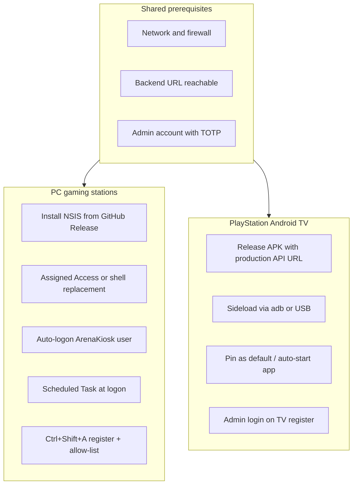

# Station deployment guide (IT)

> IT runbook for deploying and hardening Arena360 **PC gaming stations** (Windows kiosk)
> and **PlayStation stations** (Android TV Console TV). For Windows shell strategies,
> watchdog design, and GPO detail, see
> [KIOSK-WINDOWS-DEPLOYMENT.md](KIOSK-WINDOWS-DEPLOYMENT.md).

## Overview

| Station type | App | Lockdown | Auto-start on boot |
|--------------|-----|----------|-------------------|
| **PC gaming** | [apps/kiosk](../apps/kiosk) (Tauri) | In-app (shipped) + OS shell (IT configures) | Manual today; installer hook planned (K10) |
| **PlayStation TV** | [apps/console-tv](../apps/console-tv) (Android TV) | **Not in app** — TV/OEM settings only | **Not in app** — TV/OEM or third-party launcher |

Both station types use the same **admin-on-device provisioning** flow: an admin signs in
physically at the station, names it, and the device receives a long-lived device JWT. No
registration codes or SSO pairing buttons are required.



---

## 1. Shared prerequisites (both platforms)

Complete these before imaging or deploying any station.

### Network and backend

- [ ] Backend API is reachable from the station VLAN (HTTPS in production).
- [ ] WebSocket endpoint is reachable: `wss://<api-host>/realtime` (derived from API URL).
- [ ] Firewall allows outbound HTTPS (443) and WSS to your Arena360 backend.
- [ ] Station clock is accurate (NTP) — session countdown depends on local time when offline.

### Admin account

- [ ] At least one admin account exists in the Arena360 admin app.
- [ ] TOTP is enabled if your venue policy requires it (Console TV and kiosk both support
  admin login + authenticator code).
- [ ] Admin credentials are **not** shared with players; use per-site admin accounts.

### Optional: pre-create device record

You do **not** need a pre-created device record — provisioning creates the row. However,
pre-creating a device in admin helps align metadata:

1. Open **Admin → Devices → Add device**.
2. Set device type, sub-type, and location to match what staff will enter on the station.
3. On the device detail page, follow the provisioning card:
   - PC: [KioskProvisioningCard](../apps/admin/src/components/KioskProvisioningCard.tsx)
   - PS: [ConsoleTvProvisioningCard](../apps/admin/src/components/ConsoleTvProvisioningCard.tsx)

Provisioning flow is defined in
[DRAFT-0023](adr/DRAFT-0023-admin-authorized-device-registration.md) (implemented in code).

---

## 2. PC gaming stations (Windows)

### Fleet checklist

Use this as a tick-box runbook. Detailed shell options (Assigned Access, shell
replacement, Run key) are in
[KIOSK-WINDOWS-DEPLOYMENT.md](KIOSK-WINDOWS-DEPLOYMENT.md).

- [ ] **Golden image:** Windows 10/11, GPU drivers, games, Microsoft Edge WebView2 runtime
  (embedded by NSIS installer on Win10; pre-install for fully offline imaging — see
  [apps/kiosk/README.md](../apps/kiosk/README.md)).
- [ ] **Dedicated local user:** Create `ArenaKiosk` (or venue-specific name) with **no**
  administrator rights.
- [ ] **Install kiosk:** Download latest NSIS `perMachine` installer from GitHub Release
  ([ADR-0028](adr/0028-kiosk-release-pipeline-and-auto-update.md)). Default path:
  `C:\Program Files\Arena360\kiosk\Arena360 Kiosk.exe`.
- [ ] **Shell strategy:** Choose one (recommend **Option A — Assigned Access** on
  Windows Pro/Enterprise). See
  [KIOSK-WINDOWS-DEPLOYMENT.md § Layer 1](KIOSK-WINDOWS-DEPLOYMENT.md#layer-1--os-kiosk-shell-operator--it).
- [ ] **Auto-logon:** Enable auto-logon for the kiosk user (Sysinternals Autologon or
  unattend XML). Never store passwords in git.
- [ ] **Start on logon:** Create a Scheduled Task (run as kiosk user):
  - Trigger: **At log on**
  - Action: Start `Arena360 Kiosk.exe`
  - Settings: restart every 1 minute on failure
- [ ] **Optional faster recovery:** Add a second task every 5 minutes:

  ```powershell
  $name = "Arena360 Kiosk"
  if (-not (Get-Process -Name $name -ErrorAction SilentlyContinue)) {
    Start-Process "C:\Program Files\Arena360\kiosk\Arena360 Kiosk.exe"
  }
  ```

- [ ] **GPO hardening (recommended):** `DisableTaskMgr`, `DisableLockWorkstation`,
  `DisableChangePassword`.
- [ ] **First boot provisioning:** Operator at station presses **Ctrl+Shift+A** → admin
  login → register device → curate software allow-list in setup.
- [ ] **Post-deploy QA:** Run [kiosk-windows-qa-checklist.md](kiosk-windows-qa-checklist.md).

### Lockdown layers

Arena360 PC lockdown has two layers. **Both** are required for a hardened public station.

| Layer | Owner | What it does |
|-------|-------|--------------|
| **In-app (shipped)** | Arena360 kiosk | Blocks Win keys, Alt+F4, Ctrl+Esc, Ctrl+Shift+Esc; hides taskbar while locked; prevents window close in `Locked` state. See [ADR-0020](adr/0020-kiosk-windows-lockdown.md). |
| **OS (IT configures)** | IT | Assigned Access, shell replacement, or Run key + GPO. Without OS hardening, Ctrl+Alt+Del and Explorer remain reachable. |

**Lockdown states:**

- `Locked` — player attract / session; hotkeys blocked, close blocked.
- `SetupRelaxed` — admin logged into setup; lockdown relaxed for allow-list editing and
  software testing. Returns to `Locked` on logout, 15-minute idle, or player session start.

### Staff shortcuts (login screen)

| Shortcut | Action |
|----------|--------|
| Ctrl+Shift+A | Open setup / admin login |
| Ctrl+Shift+B | Clear player login lockout (“too many attempts”) |
| Ctrl+Shift+H | Raise kiosk above game overlay (during session) |

### What is not automated yet

These require manual IT setup today (K10 engineering roadmap):

- Boot auto-start checkbox in the NSIS installer
- Watchdog sidecar for sub-5 s relaunch after crash/kill
- Fleet script `scripts/windows/configure-station.ps1` (not in repo yet)

See [PLANNER-KIOSK.md — K10](PLANNER-KIOSK.md) and
[KIOSK-WINDOWS-DEPLOYMENT.md § Manual setup now](KIOSK-WINDOWS-DEPLOYMENT.md#manual-setup-now-before-k10-ships).

### Production API URL (PC)

Kiosk API URL is baked in at build time via `VITE_API_URL` in
[apps/kiosk/.env.example](../apps/kiosk/.env.example). CI/release builds use GitHub Actions
variables. For custom fleet builds, set `VITE_API_URL=https://api.yourvenue.com` before
running `pnpm --filter @gaming-cafe/kiosk tauri:build`.

---

## 3. PlayStation Android TV stations

Console TV is sideloaded today (GitHub Release APK). Play Store distribution is not
configured.

### Fleet checklist

- [ ] **Obtain APK** with production API URL baked in (see below).
- [ ] **Enable sideloading** on the TV (Developer options + USB debugging, or OEM file
  manager install).
- [ ] **Install APK** via `adb` or USB (see Sideload install).
- [ ] **Configure auto-start on boot** via TV/OEM settings (app has no boot receiver).
- [ ] **Harden TV** — restrict Settings/guest access where possible (see Lockdown).
- [ ] **HDMI + CEC:** Connect PlayStation to TV HDMI; enable HDMI-CEC in TV settings.
- [ ] **First boot provisioning:** Open Arena360 Console TV → admin login → register station.
- [ ] **Post-deploy smoke test:** Complete checklist below.

### Build / obtain APK

**Option A — GitHub Release (recommended for IT)**

1. Download the signed release APK from the latest GitHub Release (built by
   `console-tv-release.yml`).
2. Confirm the release was built with production `VITE_API_URL` / `VITE_GATEWAY_URL` CI
   variables. If unsure, use Option B.

**Option B — Build locally with production URLs**

1. Create `apps/console-tv/.env.local`:

   ```env
   VITE_API_URL=https://api.yourvenue.com
   VITE_GATEWAY_URL=wss://api.yourvenue.com/realtime
   ```

2. Build release APK:

   ```bash
   cd apps/console-tv
   bundle install   # first time only; requires keystore for release
   bundle exec fastlane release
   ```

   Artifacts land in `apps/console-tv/fastlane/build/`.

**Important:** Builds without `.env.local` default to emulator loopback
(`http://10.0.2.2:3000`) — stations will not reach a production backend.

API URLs are compiled into `BuildConfig` at build time
([apps/console-tv/app/build.gradle.kts](../apps/console-tv/app/build.gradle.kts)).

### Sideload install

Package id: `com.gamingcafe.consoletv`

**Via adb (network or USB):**

```bash
# Enable Developer options + USB debugging on the TV, then:
adb connect <tv-ip-address>
adb install -r arena360-console-tv.apk
```

**Via USB file manager (TV-dependent):**

1. Copy APK to a USB drive.
2. Insert into TV; open the TV's file manager.
3. Select the APK and confirm install (may require “Install unknown apps” permission).

**Reinstall / clean slate:**

```bash
adb uninstall com.gamingcafe.consoletv
adb install -r arena360-console-tv.apk
```

Or: **Settings → Apps → Arena360 Console TV → Clear data** (keeps app, clears device JWT).

### Auto-start on boot

The Console TV app does **not** register a `BOOT_COMPLETED` receiver. IT must configure
auto-start at the OS/TV level. Options, ranked by typical reliability:

1. **OEM “start app on boot”** — Some Android TV brands expose this in Settings or a
   service menu. Verify per TV model (Samsung, LG, Sony, etc. differ).
2. **Default launcher / home app** — Where Android TV allows pinning Arena360 Console TV
   as the home experience (limited on Google TV).
3. **Third-party auto-start apps** — Generic Android “launch on boot” utilities exist;
   review security and vendor support before deploying fleet-wide.
4. **Future:** App-level boot receiver (not implemented; would require a feature change).

After power cycle, confirm Arena360 Console TV opens without manual launch before handing
the station to operators.

### Lockdown / kiosk mode (limitations)

Console TV has **no** equivalent to Windows in-app lockdown ([ADR-0020](adr/0020-kiosk-windows-lockdown.md)).
The app’s **KioskHome** phase is an idle UI state, not OS kiosk mode.

**IT mitigations:**

- Disable guest mode and restrict access to TV Settings (OEM parental controls or MDM if
  available).
- Hide or uninstall non-essential apps from the TV launcher.
- Physical layout: HDMI from TV to PlayStation only; avoid exposing other inputs.
- Document a break-glass admin path (e.g. factory reset via Settings) for maintenance.

### First-time provisioning

1. Launch **Arena360 Console TV** on the PlayStation station.
2. Sign in with admin username and password (enter TOTP if required).
3. Enter station name, choose **PS5** or **PS4**, sub-type
   (`PREMIUM_TV_CONSOLES` / `STANDARD_TV_CONSOLES`), and optional location.
4. Tap **Register device**.

The TV calls `POST /auth/login/admin` then `POST /devices/provision` with
`provisionClient: "console-tv"`, stores the device JWT, connects WebSocket, and shows
KioskHome until an admin starts a session from the web app.

**Admin-started sessions only** — players do not log in on the TV.

To re-register: clear app data or uninstall/reinstall (see Sideload install).

### Hardware / CEC

- Connect PlayStation to the TV via HDMI.
- Enable **HDMI-CEC** (may be labeled Anynet+, Bravia Sync, Simplink, etc.) in TV settings.
- On session start, the TV attempts CEC `oneTouchPlay` to switch to the console input.
- If CEC discovery fails, the app shows a degraded banner: *“CEC unavailable — switch HDMI
  manually”* ([US-TV-007](REQUIREMENTS-CONSOLE-TV.md)).

### Post-deploy smoke test (Console TV)

| # | Steps | Expected | Pass |
|---|--------|----------|------|
| 1 | Launch Arena360 Console TV | Logo and looping background video visible | |
| 2 | Complete admin registration | Success message; app reaches KioskHome | |
| 3 | Open device in admin | Registration status shows `registered` | |
| 4 | Observe KioskHome | Status shows **Connected** (WebSocket live) | |
| 5 | Admin starts session for this device | TV shows session screen with countdown | |
| 6 | CEC test | TV switches to PlayStation HDMI input (or degraded banner) | |
| 7 | Let session expire (or admin force-end) | TV returns to KioskHome | |

---

## 4. Troubleshooting

| Symptom | PC kiosk | Console TV |
|---------|----------|------------|
| Cannot reach backend | Verify `VITE_API_URL` in build/CI; check firewall and DNS | Rebuild APK with correct `VITE_API_URL` in `.env.local` |
| App not starting on boot | Verify Scheduled Task / Assigned Access / shell replacement | Check TV OEM auto-start setting; confirm app not force-stopped |
| Stuck on registration | Confirm admin credentials and TOTP; check backend logs | Same; ensure device type is PS4/PS5 only |
| Need to re-provision | Setup → Factory reset, or clear tokens via setup | Settings → Apps → Clear data, or `adb uninstall` |
| Player cannot sign in | Check login lockout; staff **Ctrl+Shift+B** on login screen | N/A — no player login on TV |
| Session not starting (TV) | N/A | Confirm WebSocket connected; verify admin started session for correct device |
| Wrong HDMI input (TV) | N/A | Enable CEC; switch input manually if degraded banner shown |
| WebView2 / blank UI (PC) | Install WebView2 runtime; see kiosk README | N/A |

---

## 5. References

| Document | Purpose |
|----------|---------|
| [KIOSK-WINDOWS-DEPLOYMENT.md](KIOSK-WINDOWS-DEPLOYMENT.md) | Windows shell strategies, watchdog design, GPO, manual auto-restart |
| [kiosk-windows-qa-checklist.md](kiosk-windows-qa-checklist.md) | PC kiosk post-deploy QA |
| [apps/kiosk/README.md](../apps/kiosk/README.md) | Kiosk dev, packaging, env vars, staff shortcuts |
| [apps/console-tv/README.md](../apps/console-tv/README.md) | Console TV dev, build, Fastlane, adb |
| [REQUIREMENTS-KIOSK.md](REQUIREMENTS-KIOSK.md) | PC kiosk functional requirements |
| [REQUIREMENTS-CONSOLE-TV.md](REQUIREMENTS-CONSOLE-TV.md) | Console TV functional requirements |
| [ADR-0020](adr/0020-kiosk-windows-lockdown.md) | Windows in-app lockdown |
| [ADR-0028](adr/0028-kiosk-release-pipeline-and-auto-update.md) | Kiosk installer and auto-update |
| [DRAFT-0023](adr/DRAFT-0023-admin-authorized-device-registration.md) | Admin-on-device provisioning |
| [DRAFT-0037](adr/DRAFT-0037-console-tv-kiosk-style-provisioning.md) | Console TV provisioning model |
| [PLANNER-KIOSK.md — K10](PLANNER-KIOSK.md) | Boot auto-start and watchdog roadmap |

---

## Out of scope (future)

- Google Play Store distribution for Console TV (`supply` not configured)
- Android Device Owner / MDM kiosk mode (no app support)
- Automated `configure-station.ps1` and watchdog binary (K10)
- App-level boot receiver for Console TV
