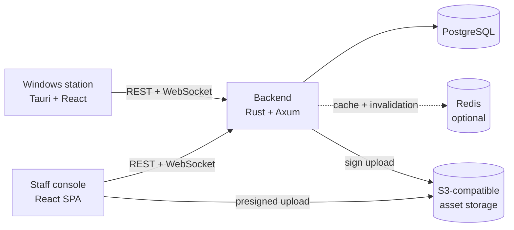

# Arena360: current system

Last verified against the repository on 2026-09-23.

Arena360 runs the day-to-day operations of a gaming cafe. It connects a staff
console and Windows gaming stations to a central backend and one PostgreSQL
database.

## System shape



### Runtime surfaces

| Surface | Current responsibility |
|---|---|
| Staff console | Permission-aware workflows for sessions, sales, players, stations, finance, inventory, reporting, and configuration |
| Windows kiosk | Device provisioning, player sign-in and registration, timed sessions, game discovery and launch, local lockdown, process cleanup, ordering, and offline recovery |
| Backend | Authentication, authorization, domain rules, transactions, reporting, OpenAPI, realtime delivery, caching, and external integration boundaries |
| PostgreSQL | Authoritative operational data, audit data, notifications, and realtime outbox/delivery state |
| Redis | Optional response cache and cross-instance invalidation; never the system of record |

## Implemented capabilities

| Area | What the system can do now |
|---|---|
| Identity and access | Admin, staff, player, and device identities; JWT sessions; role permissions; admin/staff login; TOTP enrollment and verification; device-bound player authentication |
| Player management | Create and update players, change credentials, activate or suspend access, self-register from a provisioned kiosk, view player activity and plan balances |
| Station management | Register and provision gaming PCs, classify stations, track operational status, place stations into maintenance or out-of-service states, and present a live station floor |
| Plans and balances | Create sellable time plans and Happy Hours plans, purchase player balances, select an eligible balance, validate access, apply time-of-day deduction profiles, and top up an active player |
| Sessions | Start, inspect, heartbeat, reconcile, and end sessions; enforce one active session per player; support staff-initiated and player-initiated ends; persist the balance snapshot used at login |
| PC kiosk | Lock down the station, provision with an admin account, sign in or register players, show remaining time, launch only locally allowed software, track and close launched processes, restore sessions after restart, and apply a configurable offline grace period |
| Game catalog and media | Manage games and their presentation metadata; issue presigned URLs for direct uploads to S3-compatible storage; use a CDN gallery when configuring kiosk launch entries |
| POS and ordering | Sell plans and products, record cash, online, split, or credit payment methods, retain online payment reference metadata, accept kiosk product orders, and convert accepted kiosk orders into transactions |
| Shifts and cash | Clock staff in and out, hand over or force-close shifts, open and close cash registers, record register entries, calculate expected closing cash, and reconcile variances |
| Deposits and expenses | Initiate and approve/reject cash deposits; manage vendors and expense categories; record, approve/reject, summarize, and audit expenses |
| Credit and allowances | Set player credit limits, track outstanding tabs, settle selected credit items, view settlement history, and configure staff gaming allowances |
| Inventory | Manage locations, current stock, receipts, manual adjustments, transfer requests with approval and fulfillment, waste events with approval, and receipt/waste reporting |
| Reporting | Admin and staff dashboards, revenue by payment method, usage metrics, top performers, finance reconciliation, deposit metrics, variance analysis, notifications, and an activity log |
| Realtime | Push device, session, balance, sale, order, and notification changes over one role-gated WebSocket channel backed by a transactional outbox |
| Configuration | Store and update runtime configuration through permission-protected API and staff-console settings screens |

## Access model

Human accounts use the roles `admin`, `staff`, and `player`. The shared
contracts package maps those roles to named permissions such as
`sessions:write`, `inventory:waste_approve`, and
`cash-registers:reconcile`. The admin console uses the same permission names
to hide and guard routes, while backend handlers enforce the authoritative
role checks.

Station clients use a device JWT. Player operations on a Windows kiosk require
both the device bearer token and a device-bound player token in
`X-Player-Token`. This prevents a player credential from being used as a
general staff or device credential.

All authenticated JWTs are validated for signature, expiry, issuer
(`gamezone`), and audience (`gamezone`). `JWT_SECRET` is mandatory and must
contain at least 32 characters.

## Backend organization

The backend is a layered Rust application:

```text
HTTP handlers
    ↓
domain services and transaction orchestration
    ↓
SQLx repositories
    ↓
PostgreSQL
```

Cross-cutting modules provide authentication extractors, validation, response
envelopes, caching, OpenAPI generation, health checks, object-storage signing,
notifications, server-sent-event support, and the WebSocket subsystem.

Business writes that need realtime delivery add an event to the PostgreSQL
outbox in the same transaction. A dispatcher fans those events out to
connected clients. Delivery records and acknowledgements provide
at-least-once semantics for durable channels, so consumers must tolerate
duplicate events.

## Data and integration boundaries

- PostgreSQL 16 is the source of truth. SQL migrations live in
  `apps/backend/migrations`.
- PgBouncer is supported in transaction mode; the SQLx statement cache is
  disabled for compatibility.
- Redis 7 is optional. Startup falls back to a no-op cache if Redis cannot be
  reached.
- Game-media uploads use short-lived S3 Signature V4 URLs. File bytes travel
  directly from the browser to object storage.
- The backend exposes liveness and readiness endpoints and serves Swagger UI
  only outside production.
- API response models are described by the generated OpenAPI document.
  `packages/api-types` is generated from that document for TypeScript clients.

## Deliberate boundaries

These are useful limits when reading the feature list:

- “Online” is a recorded payment method and reference, not an in-repo payment
  gateway integration.
- Redis accelerates reads and coordinates invalidation; losing it does not lose
  business data.
- The kiosk's software allow-list and launch metadata are station-local. The
  central game catalog and CDN gallery provide presentation data but do not
  make an executable safe to launch.
- Object storage is optional. Catalog operations still work without it, but
  presigned uploads return a configuration error.
