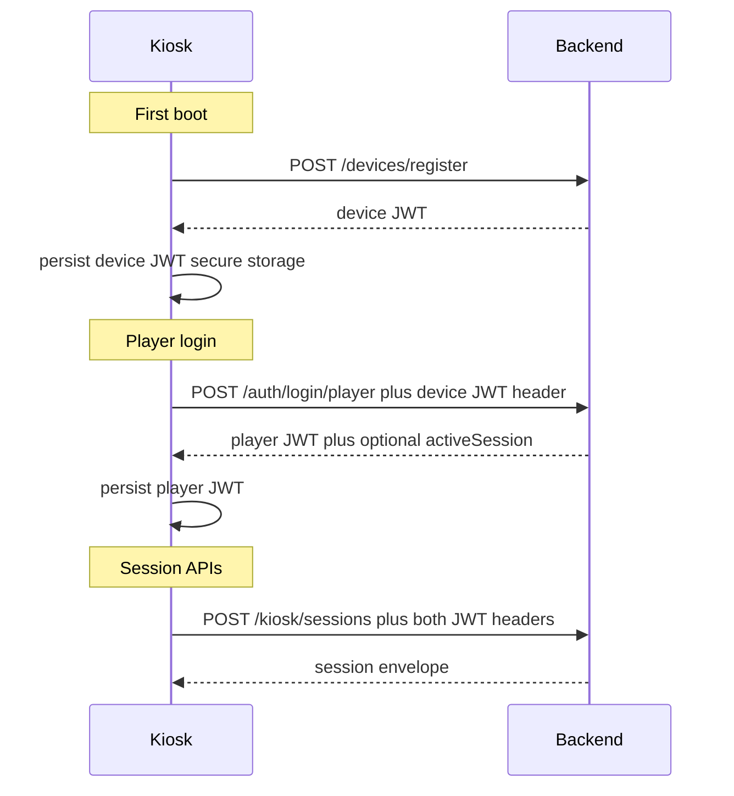

# ADR-0017: Kiosk player and device JWT authentication

**Status**: Accepted
**Date**: 2026-05-30
**Deciders**: Platform team (gaming-cafe kiosk working group)

**Implements**: [REQUIREMENTS-KIOSK.md](../REQUIREMENTS-KIOSK.md) §4.1, §4.3, §7.2
**Companion**: [ADR-0016](0016-kiosk-monorepo-reintroduce.md) (Accepted)

## Context

The kiosk v1 PRD ([REQUIREMENTS-KIOSK.md](../REQUIREMENTS-KIOSK.md)) requires two
distinct authentication principals:

1. **Device identity** — every kiosk machine authenticates on every API call after
   one-time registration (US-KREG-001).
2. **Player identity** — a logged-in player receives a short-lived JWT scoped to
   the kiosk + device so session APIs run without staff credentials (US-KAUTH-001,
   US-KAUTH-002).

The Rust backend today supports only admin and staff login
(`POST /auth/login/admin`, `POST /auth/login/staff`) via
[`apps/backend/src/middleware/auth.rs`](../../apps/backend/src/middleware/auth.rs).
JWT claims ([`JwtUserClaims`](../../apps/backend/src/dto/auth_dto.rs)) carry
`userId` and `roles: admin | staff | player` but there is no **device** token
type and no `deviceId` binding on player tokens.

[REQUIREMENTS-KIOSK.md §7.2](../REQUIREMENTS-KIOSK.md) lists the gaps blocking
kiosk v1:

| Gap | PRD requirement |
|-----|-----------------|
| No player login endpoint | `POST /auth/login/player` → player JWT |
| No device registration API | `POST /devices/register` → device JWT |
| Sessions are staff-only | Player/device-scoped session start/end |
| One session per player globally | Reject login when player has open session elsewhere (US-KAUTH-006) |

Player accounts already exist in `users` with `role = 'player'` and bcrypt
passwords verified by [`auth_service.rs`](../../apps/backend/src/services/auth_service.rs).
This ADR adds kiosk-specific token issuance and HTTP contracts — not a new identity
model.

**`device` is a JWT principal, not a `UserRole`.** Do not add `device` to
[`UserRole`](../../packages/contracts/src/roles.ts). Device tokens use
`roles: ["device"]` in `JwtUserClaims` only.

Open questions resolved here:

| ID | Question | Decision (this ADR) |
|----|----------|---------------------|
| OQ-1 | Staff shift vs system shift for kiosk sessions | **System kiosk shift** per venue |
| OQ-3 | Player JWT lifetime and refresh on long sessions | **24 h fixed**, no refresh token in v1 |
| OQ-9 | Same-device re-login after crash | **Resume** existing open session |

WebSocket ACL changes for device tokens are **out of scope** — see companion
DRAFT for `kiosk-adr-ws-acl` (amends ADR-0013).

## Decision

We will introduce **dual JWT authentication** for the kiosk: a long-lived **device
JWT** on every request and an optional short-lived **player JWT** while a player
is logged in.

### Authentication flow



### Dual-header HTTP contract

| Header | When | Value |
|--------|------|-------|
| `Authorization: Bearer <device-jwt>` | Every authenticated kiosk request after registration | **Required** |
| `X-Player-Token: Bearer <player-jwt>` | Player-scoped routes (session start/end, poll, member) | Present only while player logged in |

Rationale:

- Device identity on every call enables fingerprint drift checks, audit (`deviceId`
  in logs), and WebSocket connection auth without re-registration.
- Player token is clearable on logout/session end without invalidating device
  registration.

For `POST /auth/login/player`, only the device JWT is required in
`Authorization`; the player JWT is returned in the response body.

Implementation note: [`auth_middleware`](../../apps/backend/src/middleware/auth.rs)
decodes `Authorization` into request extensions. Player-scoped handlers additionally
read and validate `X-Player-Token` (must decode to a player JWT whose `deviceId`
matches the device JWT).

### API surface

| Method | Path | Auth | Purpose |
|--------|------|------|---------|
| `POST` | `/devices/register` | **Public** | One-time registration code exchange |
| `POST` | `/auth/login/player` | Device JWT | Username/password → player JWT |
| `POST` | `/kiosk/sessions` | Device + player JWT | Start session on registered device |
| `PATCH` | `/kiosk/sessions/:id/end` | Device + player JWT | End own session |

Add `/devices/register` to `PUBLIC_EXACT` in auth middleware (same pattern as
existing login routes).

#### `POST /devices/register`

**Request:**

```json
{
  "registrationCode": "ABC-123",
  "fingerprint": {
    "mac": "AA:BB:CC:DD:EE:FF",
    "serial": "SN-12345",
    "biosUuid": "xxxxxxxx-xxxx-xxxx-xxxx-xxxxxxxxxxxx",
    "platform": "windows",
    "collectedAt": "2026-05-30T12:00:00Z"
  },
  "name": "PC-01",
  "serialNumber": "SN-12345",
  "deviceType": "pc",
  "deviceSubType": "gaming",
  "location": "Floor 1",
  "ipAddress": "192.168.1.10"
}
```

**Success (200):**

```json
{
  "data": {
    "accessToken": "<device-jwt>",
    "device": {
      "id": "uuid",
      "name": "PC-01",
      "registrationStatus": "registered",
      "deviceType": "pc",
      "deviceSubType": "gaming",
      "status": "available"
    }
  },
  "statusCode": 200,
  "message": "OK"
}
```

**Errors:**

| HTTP | `message` (ErrorCode) | When |
|------|----------------------|------|
| 401 | `DEVICE_REGISTRATION_INVALID` | Code expired, reused, or not found |

On success: invalidate code server-side; set `devices.registrationStatus = registered`;
persist fingerprint JSON on `devices.registeredKiosk`.

**Registration code storage (schema sketch):**

Columns on `devices` (migration in K1 — not part of accepting this ADR alone):

- `registrationCode` — nullable, unique while pending
- `registrationCodeExpiresAt` — timestamptz
- `registrationCodeUsedAt` — timestamptz, set on successful exchange

If schema change requires non-trivial migration, a follow-on migration note in K1
is acceptable; this ADR defines the contract only.

#### `POST /auth/login/player`

**Request headers:** `Authorization: Bearer <device-jwt>`

**Request body:**

```json
{
  "username": "player1",
  "password": "secret"
}
```

**Pre-checks (in order):**

1. Device JWT valid; device `registrationStatus = registered`.
2. Device `status != under_maintenance` (US-KREG-006).
3. Fingerprint drift OK (delegates to fingerprint service — see
   [`be-fingerprint-drift`](../PLANNER-KIOSK.md)).
4. Username/password valid; user `role = player`; user active.
5. Single-session rule (see below).

**Success (200):**

```json
{
  "data": {
    "accessToken": "<player-jwt>",
    "user": {
      "id": "uuid",
      "username": "player1",
      "role": "player",
      "isActive": true
    },
    "activeSession": null
  },
  "statusCode": 200,
  "message": "OK"
}
```

When the player has an **open session on this same device** (crash re-login, OQ-9),
`activeSession` is populated instead of `null`:

```json
{
  "activeSession": {
    "id": "uuid",
    "startTime": "2026-05-30T10:00:00Z",
    "balanceId": "uuid",
    "remainingMinutes": 42.5
  }
}
```

The kiosk skips `POST /kiosk/sessions` when `activeSession` is present.

**Errors:**

| HTTP | `message` (ErrorCode) | When |
|------|----------------------|------|
| 401 | `AUTH_INVALID_CREDENTIALS` | Wrong username/password |
| 403 | `DEVICE_NOT_REGISTERED` | Device not registered |
| 403 | `DEVICE_UNDER_MAINTENANCE` | Device under maintenance |
| 403 | `DEVICE_FINGERPRINT_MISMATCH` | ≥2 fingerprint components changed |
| 409 | `PLAYER_ALREADY_IN_SESSION` | Open session on **another** device |

Response envelope matches existing staff login (`AuthResponseDto` extended with
optional `activeSession`).

### JWT claims

Extend `JwtUserClaims` with one optional field (backward-compatible with existing
admin/staff tokens):

```rust
#[serde(skip_serializing_if = "Option::is_none")]
pub deviceId: Option<String>,  // UUID string
```

| Claim | Device JWT | Player JWT (kiosk) | Admin/staff (unchanged) |
|-------|------------|-------------------|-------------------------|
| `sub` / `userId` | `devices.id` | `users.id` | `users.id` |
| `roles` | `["device"]` | `["player"]` | `["admin"]` or `["staff"]` |
| `deviceId` | same as `userId` | **required** — issuing kiosk | omitted |
| `tenantId`, `iss`, `aud` | `dualshock-arena` / `gamezone` | same | same |
| `appId` | `game-zone-kiosk` | `game-zone-kiosk` | `game-zone-backend` |

Signing: same HS256 secret (`JWT_SECRET`) and issuer/audience validation as
existing tokens.

#### Middleware extractors

Add to [`apps/backend/src/middleware/auth.rs`](../../apps/backend/src/middleware/auth.rs):

| Extractor | Validates | Exposes |
|-----------|-----------|---------|
| `DeviceUser` | `roles` contains `device` | `device_id: Uuid` |
| `PlayerUser` | `roles` contains `player`; `deviceId` present; matches device JWT if both present | `player_id: Uuid`, `device_id: Uuid` |

Player session routes (`/kiosk/sessions/*`) use **both** extractors. They must
**not** require `AdminOrStaff`.

### Token lifetimes (OQ-3)

| Token | TTL | Config env | Refresh |
|-------|-----|------------|---------|
| Device JWT | **365 days** | `JWT_DEVICE_EXPIRATION` (default `365d`) | Re-registration or admin revoke (US-KREG-008 Should) |
| Player JWT | **24 hours** | `JWT_PLAYER_EXPIRATION` (default `24h`) | **None in v1** — re-enter password |

Parse duration using the same suffix rules as `JWT_ACCESS_EXPIRATION` in
[`auth_service.rs`](../../apps/backend/src/services/auth_service.rs) (`m`, `h`, `d`).

**Mid-session player JWT expiry:** The server-side `usage_sessions` row continues.
Player-scoped API calls return `401` with `message: AUTH_TOKEN_EXPIRED`. The kiosk
shows a "Session locked — re-enter password" overlay. Successful re-login on the
same device returns `activeSession` and resumes without creating a duplicate
session row.

NFR: player JWT ≤ 24 h ([REQUIREMENTS-KIOSK.md §6.3](../REQUIREMENTS-KIOSK.md)).

Admin tokens remain 15 minutes; staff tokens remain governed by
`JWT_ACCESS_EXPIRATION`.

### Shift binding (OQ-1)

Kiosk-started sessions bind to a **system kiosk shift** per venue:

- One `shifts` row per tenant with a well-known identifier (e.g. fixed name
  `KIOSK_SYSTEM` or boolean `isSystemKiosk = true` on the shifts table).
- `usage_sessions.shiftId` for kiosk-started sessions always references this row.
- Staff POS sessions continue using the staff member's active shift unchanged.

If no system shift exists, the first kiosk session create inserts it idempotently
(K1 implementation detail).

Reporting may filter kiosk sessions via shift name or a session metadata tag
`startedBy: kiosk` (optional K1 column or audit field).

### Single-session rule and crash re-login (OQ-9)

**Global rule:** At most one `usage_sessions` row with `endTime IS NULL` per
player (across all devices). Enforced at `POST /auth/login/player` and
`POST /kiosk/sessions`.

| Scenario | Behavior |
|----------|----------|
| Player active on **another** device | `409 PLAYER_ALREADY_IN_SESSION` with structured `details` |
| Player active on **same** device (crash) | Login succeeds; `activeSession` returned; no duplicate session |
| Prior session ended | Normal flow: login → balance check → `POST /kiosk/sessions` |

**409 response example:**

```json
{
  "statusCode": 409,
  "message": "PLAYER_ALREADY_IN_SESSION",
  "error": "Conflict",
  "timestamp": "2026-05-30T12:00:00Z",
  "details": {
    "deviceId": "uuid",
    "deviceName": "PC-02",
    "sessionId": "uuid",
    "sessionStartTime": "2026-05-30T10:00:00Z"
  }
}
```

This aligns with [`ApiError.fromErrorEnvelope`](../../packages/utils/src/http/ApiError.ts):
when `message` matches a known `ErrorCode`, clients map it via `isErrorCode()`.

**Distinction from `ACTIVE_SESSION_EXISTS`:** That code applies when the same
**balance** already has an open session (per-balance guard in
[`session_service.start`](../../apps/backend/src/services/session_service.rs)).
`PLAYER_ALREADY_IN_SESSION` applies when the same **player** has an open session
on a different device. Keep both.

K1 will extend `AppError` with optional `details: serde_json::Value` for structured
conflict context.

### Error codes (contracts cross-reference)

On ADR acceptance, add to [`packages/contracts/src/errors.ts`](../../packages/contracts/src/errors.ts):

| Code | HTTP | Message (default) |
|------|------|-------------------|
| `PLAYER_ALREADY_IN_SESSION` | 409 | You are already logged in on another device |
| `DEVICE_FINGERPRINT_MISMATCH` | 403 | Device hardware fingerprint mismatch — re-register with staff |
| `DEVICE_REGISTRATION_INVALID` | 401 | Registration code is invalid or expired |
| `DEVICE_NOT_REGISTERED` | 403 | Device is not registered |

Existing codes reused: `AUTH_INVALID_CREDENTIALS`, `AUTH_TOKEN_EXPIRED`,
`DEVICE_UNDER_MAINTENANCE`.

### Tauri secure storage contract

Tokens must not be stored in `localStorage` or plain files
([REQUIREMENTS-KIOSK.md §6.3](../REQUIREMENTS-KIOSK.md)).

| Storage key | Content | Cleared when |
|-------------|---------|--------------|
| `gaming-cafe.kiosk.device_token` | Device JWT string | Factory reset / re-registration |
| `gaming-cafe.kiosk.player_token` | Player JWT string | Session end, logout, successful re-auth after lock overlay |

**Backend:** Tauri 2 stronghold or OS keychain plugin (Windows Credential Manager).

**Rust commands** (K2 `kiosk-secure-token-storage`):

- `get_tokens` → `{ deviceToken?, playerToken? }`
- `set_device_token(token)`
- `set_player_token(token)`
- `clear_player_token()`
- `clear_all_tokens()`

**Should:** HTTP client in Rust reads tokens from secure storage so the WebView
never handles raw JWT strings. **May (v1):** React invokes Rust commands and passes
tokens to `@gaming-cafe/utils` HTTP factory.

### Kiosk HTTP client (K2)

[`kiosk-http-client`](../PLANNER-KIOSK.md) attaches:

- `Authorization: Bearer <device-jwt>` on every request
- `X-Player-Token: Bearer <player-jwt>` when player token present
- Distinct handling for `409 PLAYER_ALREADY_IN_SESSION` and `401 AUTH_TOKEN_EXPIRED`

## Consequences

### Positive

- Clear separation of device vs player identity; logout does not require
  re-registration.
- Reuses existing bcrypt auth and JWT infrastructure (ADR-0009).
- Resolves OQ-1, OQ-3, OQ-9 with testable contracts before K1 coding.
- Error codes in `@gaming-cafe/contracts` enable kiosk UI messaging (ADR-0008).

### Negative

- Dual-header contract adds client complexity; misconfiguration causes subtle 401s.
- Long-lived device JWT (365 d) increases compromise window until admin revoke
  (US-KREG-008 Should) ships.
- System kiosk shift may conflate shift reports unless filtered in analytics.

### Risks

| Risk | Mitigation |
|------|------------|
| Dual-header miswired in kiosk HTTP client | Document here + integration tests in `be-kiosk-integration-tests` |
| `AppError` lacks `details` today | Spec envelope above; implement in first K1 auth PR |
| System shift skews reporting | Filter by shift name `KIOSK_SYSTEM` or `startedBy: kiosk` tag |
| Device JWT compromise | Admin revoke / re-registration (US-KREG-008); shorter TTL if policy changes |

## Alternatives considered

### A. Single combined JWT (player embedded in device token)

- Pros: One header only.
- Cons: Cannot clear player identity without re-registration; poor logout semantics.
- **Rejected.**

### B. Player-only JWT after registration (no persistent device token)

- Pros: Simpler client.
- Cons: No stable device identity for fingerprint drift, WS auth, or unattended
  session polling.
- **Rejected.**

### C. OAuth2 refresh tokens for players

- Pros: Seamless long sessions without re-password.
- Cons: Refresh token storage, rotation, and revocation add v1 scope; re-auth
  overlay is sufficient for cafe sessions ≤ 24 h.
- **Rejected for v1.**

## Out of scope

| Topic | Owner |
|-------|-------|
| WebSocket ACL for device tokens | `kiosk-adr-ws-acl` (amends ADR-0013) |
| Allow-list persistence | `kiosk-adr-allow-list` |
| Admin registration-code UI | `admin-kiosk-registration-codes` |
| Windows lockdown Rust commands | `kiosk-adr-lockdown` |
| Device JWT admin revoke endpoint | US-KREG-008 (Should) — follow-on K1/K5 task |

## Implementation notes

After **Acceptance**, implement in order:

1. `packages/contracts` — new `ErrorCode` entries + `ErrorMessages`
2. `JwtUserClaims.deviceId` + `DeviceUser` / `PlayerUser` middleware
3. `POST /devices/register` → `POST /auth/login/player` → single-session rule →
   `/kiosk/sessions` routes → fingerprint drift
4. `pnpm gen:api-types` after OpenAPI annotations

K1 tasks blocked until this ADR status is **Accepted**.

## References

- [REQUIREMENTS-KIOSK.md](../REQUIREMENTS-KIOSK.md) — §4.1, §4.3, §5, §6.3, §7.2
- [PLANNER-KIOSK.md](../PLANNER-KIOSK.md) — `kiosk-adr-player-auth`, dependent `be-*` tasks
- [ADR-0008](0008-runtime-contracts-package.md) — `@gaming-cafe/contracts`
- [ADR-0009](0009-rust-axum-backend.md) — layered backend, JWT auth
- [ADR-0013](0013-realtime-websocket-channel.md) — WS transport (ACL deferred)
- [ADR-0016](0016-kiosk-monorepo-reintroduce.md) — kiosk monorepo companion
