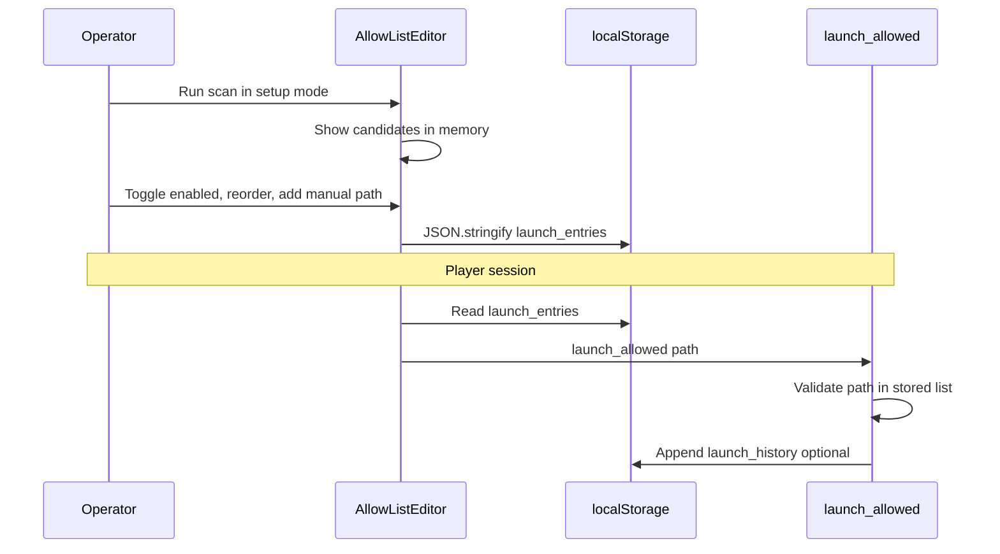

# ADR-0019: Kiosk device launch allow-list (client-side)

**Status**: Accepted
**Date**: 2026-05-30
**Deciders**: Platform team (gaming-cafe kiosk working group)

**Implements**: [REQUIREMENTS-KIOSK.md](../REQUIREMENTS-KIOSK.md) §4.2, Appendix B
**Depends on**: [ADR-0017](0017-kiosk-player-device-auth.md), [ADR-0020](0020-kiosk-windows-lockdown.md) (`launch_allowed`)

## Context

The kiosk launcher shows operator-approved executables (games, launchers, utilities)
curated per machine. The `games` / `device_games` backend tables were removed;
launcher data is device-local.

[REQUIREMENTS-KIOSK.md](../REQUIREMENTS-KIOSK.md) requires:

| Story | Priority | Requirement |
|-------|----------|-------------|
| US-KSCAN-003 | Must | Operator curates allow-list in setup mode |
| US-KSCAN-004 | Must | Hide entries whose executable no longer exists on disk |
| US-KSCAN-005 | Should | Persist allow-list to backend for admin remote edit |

**Product decision:** Keep device launch allow-list and optional launch history
**client-side only** in WebView `localStorage`. No Postgres table, no REST API,
no admin remote editing in v1. **US-KSCAN-005 is deferred** (Won't for v1).

This ADR resolves **OQ-8** (icon strategy).

## Decision

### Storage model

| Store | Key | Contents | Cleared when |
|-------|-----|----------|--------------|
| WebView `localStorage` | `gaming-cafe.kiosk.launch_entries` | JSON array of allow-list entries | Factory reset; explicit "Clear allow-list" in setup |
| WebView `localStorage` | `gaming-cafe.kiosk.launch_history` | Optional append-only launch audit log | Same as above |

**Not** Tauri secure storage — allow-list paths are not secrets (JWTs remain in
secure storage per ADR-0017).

**No backend persistence in v1.** Tasks `be-allow-list-storage` and
`admin-device-allow-list` are **cancelled**.

### Entry schema

Each element in `launch_entries` matches Appendix B plus ordering:

```typescript
interface LaunchEntry {
  id: string;              // UUID v4
  displayName: string;
  executablePath: string;  // absolute Windows path
  category: 'game' | 'launcher' | 'utility';
  arguments: string | null;
  iconKey: string | null;  // sha256(path + mtime) for local icon cache
  enabled: boolean;
  sortOrder: number;
}
```

Example:

```json
{
  "id": "550e8400-e29b-41d4-a716-446655440000",
  "displayName": "Steam",
  "executablePath": "C:\\Program Files (x86)\\Steam\\steam.exe",
  "category": "launcher",
  "arguments": null,
  "iconKey": "a1b2c3…",
  "enabled": true,
  "sortOrder": 0
}
```

### Launch history schema (optional)

```typescript
interface LaunchHistoryRecord {
  entryId: string;
  executablePath: string;
  sessionId: string | null;
  launchedAt: string;  // ISO8601
}
```

Capped at **500** records (FIFO trim). Used for operator debug only; not synced.

### Persistence flow



1. **Scan** — `scan_installed_software` returns candidates (in memory only).
2. **Curate** — `kiosk-allow-list-editor` writes full array to `localStorage`.
3. **Re-scan merge** — Operator chooses **Replace all** or **Merge new only**
   (default: merge — add paths not already present; never delete without confirm).
4. **Player session** — Launcher grid reads `localStorage`; filters `enabled === true`
   and `fs.exists(executablePath)` (US-KSCAN-004).
5. **Launch** — `launch_allowed` Rust command loads list from JS invoke or shared
   read of persisted file; rejects paths not on list (US-KLOCK-004).

### Icon strategy (OQ-8)

- Extract embedded `.exe` icon on Windows during scan or first render.
- Cache PNG bytes in `localStorage` sub-key `gaming-cafe.kiosk.icon_cache.{iconKey}`
  or IndexedDB if size exceeds 5 MB total cache budget.
- **Icons never uploaded** to backend or R2 in v1.
- Fallback tile: category glyph + `displayName` initial when extraction fails.

### TypeScript access layer (K3)

```typescript
const LAUNCH_ENTRIES_KEY = 'gaming-cafe.kiosk.launch_entries';

export function loadLaunchEntries(): LaunchEntry[] {
  const raw = localStorage.getItem(LAUNCH_ENTRIES_KEY);
  if (!raw) return [];
  return JSON.parse(raw) as LaunchEntry[];
}

export function saveLaunchEntries(entries: LaunchEntry[]): void {
  localStorage.setItem(LAUNCH_ENTRIES_KEY, JSON.stringify(entries));
}
```

## Consequences

### Positive

- No DB migration or K1 allow-list API.
- Simpler K3; operator workflow stays on-machine.
- Icons stay local; no media upload infra.

### Negative

- **US-KSCAN-005 deferred** — admin cannot edit allow-list remotely.
- Replacement PC requires on-site re-scan and curation.
- Data lost if `localStorage` cleared without export backup.
- No cross-device consistency for multi-PC cafes with different game installs.

### Risks

| Risk | Mitigation |
|------|------------|
| localStorage quota exceeded (large icon cache) | Cap icon cache; store icons in app data dir in v1.1 if needed |
| Path case sensitivity on Windows | Normalize to canonical path on save |
| Operator forgets to curate after scan | Setup wizard blocks player mode until ≥1 enabled entry or explicit skip with warning |

## Alternatives considered

### A. `device_launch_entries` Postgres table + CRUD API

- Pros: Admin remote edit; US-KSCAN-005.
- Cons: Migration, K1 API, sync protocol complexity.
- **Rejected** — user decision for client-only v1.

### B. JSONB column on `devices`

- Pros: Single-row sync.
- Cons: Still server-side; poor admin query/edit ergonomics.
- **Rejected.**

### C. Tauri app-data JSON file instead of localStorage

- Pros: Larger quota; Rust can read without JS bridge.
- Cons: More IPC; plan specified localStorage.
- **Deferred** — may adopt in K3 if quota issues arise; ADR allows either WebView
  `localStorage` or equivalent Tauri persisted store **as long as data stays on device**.

## Out of scope

- Backend routes under `/devices/:id/launch-entries`
- Admin SPA allow-list tab
- Cloud backup / export-import (Could for v2)

## Implementation notes

After **Acceptance**:

1. Cancel `be-allow-list-storage`, `admin-device-allow-list` in PLANNER
2. `kiosk-allow-list-editor` — persist via `saveLaunchEntries()`
3. `kiosk-launch-guard` / `launch_allowed` — validate against stored list
4. Optional: export/import JSON file in setup mode for operator backup (Could)

## References

- [REQUIREMENTS-KIOSK.md](../REQUIREMENTS-KIOSK.md) — §4.2, Appendix B
- [ADR-0017](0017-kiosk-player-device-auth.md)
- [PLANNER-KIOSK.md](../PLANNER-KIOSK.md) — `kiosk-adr-allow-list`, `kiosk-allow-list-editor`
