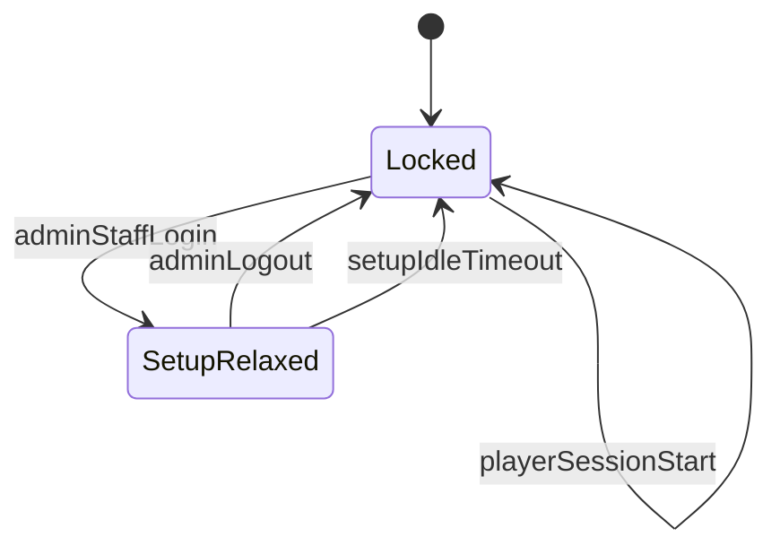

# ADR-0020: Kiosk Windows lockdown and process APIs

**Status**: Accepted
**Date**: 2026-05-30
**Deciders**: Platform team (gaming-cafe kiosk working group)

**Implements (deferred portion of)**: [ADR-0002](0002-kiosk-tauri-canonical.md)
**Depends on**: [ADR-0019](0019-kiosk-device-allow-list.md) (`launch_allowed` validation)

## Amendment 2026-06-17: superseded by DRAFT-0041

The **2026-06-15 watchdog pause IPC** amendment below is **superseded** by
[ADR-0041](0041-remove-watchdog-logon-autostart.md). Windows autostart is now a
single **Arena360 Kiosk** ONLOGON scheduled task; pause-file IPC and `arena360-watchdog.exe`
are removed.

## Amendment 2026-06-15: watchdog pause IPC (K10) — superseded

- **`SetupRelaxed`** writes `%ProgramData%\Arena360\watchdog.pause` (15 min) so the
  external `arena360-watchdog.exe` sidecar does not relaunch during setup or
  **Exit to desktop (15 min)**.
- **`Locked`** clears the pause file. Auto-update and restart/shutdown set short pauses
  before exit.
- Tauri commands: `set_watchdog_pause`, `clear_watchdog_pause`, `prepare_update_relaunch`.
- Kiosk acquires `Global\Arena360KioskInstance` mutex for single-instance coordination.

## Amendment 2026-06-14: session cleanup, z-order, and force-end

- **Window mode (`Locked`)**: Fullscreen borderless without `HWND_TOPMOST`; re-assert
  fullscreen + foreground on focus loss (respect OS Alt+Tab z-order).
- **Session-end cleanup (`kill_tracked_processes`)**: After tracked trees, sweep all
  processes in the kiosk user session except a documented system/shell/kiosk keep-list.
  Always restore the kiosk login shell (even when nothing was tracked). No grace delay.
- **Force-end (US-KPROC-003)**: Admin force-end triggers immediate cleanup — the
  5-minute kiosk grace overlay is removed.

## Amendment 2026-05-30: setup entry via Ctrl+Shift+A

The setup-mode entry point changes from the hidden 5-tap corner gesture to the
keyboard shortcut **Ctrl+Shift+A**. The native low-level keyboard hook does not
block this combination, so it reaches the webview while `Locked`. As before, the
shortcut only reveals the admin login form; lockdown stays `Locked` until an admin
authenticates (it then transitions to `SetupRelaxed`). The tap gesture is retired.

## Context

[REQUIREMENTS-KIOSK.md](../REQUIREMENTS-KIOSK.md) §4.5–4.6 requires the kiosk to:

- Block shell escape hotkeys during player sessions (US-KLOCK-001, US-KLOCK-003)
- Acknowledge `Ctrl+Alt+Del` is OS-unblockable; re-assert on focus return (US-KLOCK-002)
- Launch only allow-listed executables (US-KLOCK-004)
- Relax lockdown in setup mode when admin/staff is logged in (US-KLOCK-005, **D9**)
- Track and kill process trees spawned from the launcher (US-KPROC-001..004, **D5**)
- Collect hardware fingerprint via WMI (US-KREG-002)

[ADR-0002](0002-kiosk-tauri-canonical.md) defers Windows-specific shell behavior to
the Tauri `src-tauri/` crate. This ADR specifies Rust crates, IPC commands, and
the lockdown state machine for v1.

Platform scope: **Windows 10/11 only** (ADR-0016).

## Decision

### Rust dependencies (`apps/kiosk/src-tauri/Cargo.toml`)

| Crate | Version policy | Purpose |
|-------|----------------|---------|
| `windows` | Latest compatible with Tauri 2 | Low-level keyboard hook (`WH_KEYBOARD_LL`), foreground window, process APIs |
| `sysinfo` | Pin in lockfile | Process enumeration and termination |
| `wmi` | Optional; or raw WMI via `windows` | Fingerprint: MAC, BIOS serial, UUID |

No new npm dependencies. Rust crates are confined to `apps/kiosk/src-tauri/` —
deployment shape unchanged (no new ADR for infra).

Document exact versions in `Cargo.lock` at implementation time.

### Lockdown state machine



| State | Hotkeys | Launch policy | Window mode |
|-------|---------|---------------|-------------|
| `Locked` | Block Win, Ctrl+Esc, Alt+F4 on shell; block Explorer/Run/TM shortcuts; Alt+Tab allowed between kiosk and launched apps | `launch_allowed` only (ADR-0019 list) | Fullscreen borderless; re-assert foreground on focus loss (no TOPMOST) |
| `SetupRelaxed` | None blocked | Operator may launch any binary | Normal windowed allowed |

**Transitions (US-KLOCK-005):**

| Event | From | To |
|-------|------|-----|
| Admin/staff setup login success | `Locked` | `SetupRelaxed` |
| Admin logout | `SetupRelaxed` | `Locked` (≤ 2 s) |
| Setup idle timeout (default 15 min, configurable) | `SetupRelaxed` | `Locked` |
| Player session start (before launcher shown) | any | `Locked` |

React calls `invoke('set_lockdown_state', { state: 'Locked' | 'SetupRelaxed' })`.

### CAD limitation (US-KLOCK-002)

`Ctrl+Alt+Del` triggers the Windows Secure Attention Sequence — **cannot be blocked**
in user mode. Behavior:

1. Document in operator setup guide.
2. On `WM_ACTIVATE` / focus regain, re-apply fullscreen and hook within 500 ms.
3. Do not attempt to hook SAS (would require kernel driver — out of scope).

### Tauri IPC commands

| Command | Module | Input | Output | Called from |
|---------|--------|-------|--------|-------------|
| `set_lockdown_state` | `lockdown` | `{ state: string }` | `()` | Setup login/logout, session start/end |
| `collect_fingerprint` | `fingerprint` | none | `FingerprintPayload` | Registration, heartbeat |
| `scan_installed_software` | `scan` | `{ progressChannel? }` | `ScanCandidate[]` | Setup allow-list editor |
| `launch_allowed` | `launcher` | `{ executablePath, arguments? }` | `{ pid: number }` | Player launcher grid |
| `kill_tracked_processes` | `process` | none | `{ killed: number, restored: boolean }` | Session end (tracked + user-session sweep) |
| `get_tracked_processes` | `process` | none | `TrackedProcess[]` | Setup debug only |

Register in [`lib.rs`](../../apps/kiosk/src-tauri/src/lib.rs) and restrict via
[`capabilities/default.json`](../../apps/kiosk/src-tauri/capabilities/default.json).

**`FingerprintPayload`** (matches REQUIREMENTS-KIOSK Appendix A):

```json
{
  "mac": "AA:BB:CC:DD:EE:FF",
  "serial": "SN-12345",
  "biosUuid": "xxxxxxxx-xxxx-xxxx-xxxx-xxxxxxxxxxxx",
  "platform": "windows",
  "collectedAt": "2026-05-30T12:00:00Z"
}
```

### Process supervision (US-KPROC-*)

1. **`launch_allowed`** — Before spawn:
   - Normalize path; check against allow-list (read from JS-provided snapshot or
     last-known list passed in invoke args).
   - On success, record root PID and enqueue child PIDs via periodic poll (1 s).

2. **Tracking scope** — Only PIDs spawned by `launch_allowed` during the current
   player session. Ignore pre-existing OS processes (US-KPROC-004).

3. **Cleanup (`kill_tracked_processes`)** — all session end paths (voluntary, auto, force):
   - Terminate tracked launcher trees (`taskkill /T /F`).
   - Sweep remaining processes in the kiosk Windows session except a keep-list
     (system, `explorer.exe`, kiosk executable).
   - Restore kiosk fullscreen shell.

4. **Termination order** — Tracked trees first, then user-session sweep; children before roots.

### Module layout (`src-tauri/src/`)

```
lockdown/mod.rs    — hook install/remove, state enum
fingerprint/mod.rs — WMI collection
scan/mod.rs        — registry + common paths scan
launcher/mod.rs    — allow-list check + spawn
process/mod.rs     — tracker + kill
```

Keep modules flat; no premature trait abstraction (KISS).

## Consequences

### Positive

- Single documented surface for Windows-only behavior.
- State machine matches D9 and US-KLOCK-005 test scenarios.
- Process cleanup aligned with ggLeap-style session end.

### Negative

- Low-level hooks require careful lifecycle (install on `Locked`, remove on drop).
- Windows QA mandatory; macOS dev builds cannot validate lockdown.
- Hook failures on some GPU driver overlays — document manual QA checklist.

### Risks

| Risk | Mitigation |
|------|------------|
| Hook prevents operator emergency exit | SetupRelaxed + CAD always available |
| Anti-cheat blocks process terminate | Log failure; show "Ask staff" message |
| Allow-list stale vs localStorage | Pass fresh list snapshot into `launch_allowed` each invoke |

## Alternatives considered

### A. Electron-style `--kiosk` Chrome flag only

- Pros: Simple.
- Cons: Insufficient hotkey/process control for US-KLOCK-*.
- **Rejected** — ADR-0002 already chose Tauri + Rust core.

### B. Third-party kiosk shell (e.g. Shell Launcher)

- Pros: OS-level lockdown.
- Cons: Deployment complexity; cafe IT variance.
- **Rejected for v1.**

## Out of scope

- Linux/macOS lockdown
- Kernel-mode keyboard filter driver
- Game-specific anti-cheat integration

## Implementation notes

After **Acceptance**:

1. `kiosk-lockdown-state-machine` — `set_lockdown_state` + React integration
2. `kiosk-lockdown-hotkeys` — WH_KEYBOARD_LL implementation
3. `kiosk-launch-guard` + `launch_allowed`
4. `kiosk-process-tracker`, `kiosk-process-cleanup`
5. `kiosk-fingerprint-cmd`, `kiosk-software-scan-cmd`
6. `kiosk-cargo-tests` — unit tests for path normalization and tracker logic

## References

- [ADR-0002](0002-kiosk-tauri-canonical.md)
- [ADR-0016](0016-kiosk-monorepo-reintroduce.md)
- [ADR-0019](0019-kiosk-device-allow-list.md)
- [REQUIREMENTS-KIOSK.md](../REQUIREMENTS-KIOSK.md) — §4.5, §4.6, US-KLOCK-005 scenarios
- [PLANNER-KIOSK.md](../PLANNER-KIOSK.md) — K5 tasks
