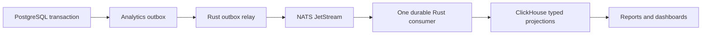

# Reporting with JetStream and ClickHouse

> **Superseded** by `docs/architecture/data-platform.md`, ADR-0043, and `docs/architecture/duckdb-analytics-schema.md` (per-tenant DuckDB; ClickHouse removed). This describes the current code until milestone M7 of `docs/plans/data-platform-build-plan.md` completes.

PostgreSQL owns transactions, payment and credit validation, session state, stock mutations, authentication, configuration, and operational record lookups. ClickHouse owns every `/stats/*` query, finance report, expense category summary, credit portfolio summary, inventory overview, receipt summary, and waste summary. Pagination counts, unread notification counts, per-player credit headroom, and reorder actions remain transactional PostgreSQL queries.



The relay and consumer run in one `analytics_worker` process, separate from API replicas. A PostgreSQL session advisory lock prevents a second active worker. `ANALYTICS_DATABASE_URL` must connect directly to PostgreSQL, not a PgBouncer transaction pool. The worker does not need JWT credentials.

## Local startup and cutover

1. Configure `apps/backend/.env` using the analytics variables in `.env.example`.
2. Start dependencies: `docker compose up -d postgres redis nats clickhouse`.
3. Apply PostgreSQL migrations: `pnpm migration run`. This installs the analytics outbox and allowlisted row triggers before backfill begins.
4. Run `pnpm analytics:backfill`. This creates ClickHouse tables/views, enqueues existing rows, and continues consuming live changes. Keep it running. Reports return `503 ANALYTICS_UNAVAILABLE` until the snapshot has been acknowledged into ClickHouse.
5. For subsequent starts, use `pnpm analytics:dev` (no snapshot required). Start the API with the same ClickHouse database configuration.

Container alternative after migration: `docker compose --profile analytics run --rm analytics-worker analytics_worker --backfill`. Stop that foreground process after readiness, then start the supervised worker with `docker compose --profile analytics up -d analytics-worker`. Do not run both simultaneously. The normal worker service deliberately does not rerun backfill at every restart.

The ClickHouse database must already exist; Compose creates `arena360`. The worker initializes its tables and views. Production should provision a reporting user with SELECT only, a separate writer/schema user for the worker, authenticated TLS NATS connections, persistent volumes, and `NATS_ANALYTICS_REPLICAS=3` on a three-node JetStream cluster. Development Compose exposes NATS and ClickHouse only on localhost.

## Delivery and correctness

- Row triggers write the outbox inside the business transaction. Rollbacks also roll back analytics events. No network service is called from a PostgreSQL transaction.
- The relay deletes an outbox row only after JetStream confirms durable publication. It polls pending rows rather than a sequence watermark, so transactions that commit out of sequence are not lost.
- One durable pull consumer (`clickhouse-v1`) reads `ARENA360_ANALYTICS`, subject `arena360.analytics.v1.rows`. It batches up to 500 messages, groups inserts by table, and acknowledges only after all synchronous inserts succeed.
- Events carry schema version, source table, row ID, row version, deletion flag, and explicitly allowlisted fields. Passwords, OTPs, tokens, and arbitrary metadata are excluded at capture and ingestion.
- Each typed `*_versions` table uses `ReplacingMergeTree(_version)`. Reporting views use `FINAL` before filtering tombstones. Duplicate and out-of-order delivery cannot inflate counts or resurrect deleted rows. Tombstones must not be TTL-deleted without a replay-safe retention design.
- Backfill rows use version zero, so concurrent live updates and deletes always win. Interrupted backfill can be rerun with `--backfill`; the readiness gate opens only after all previously published messages are acknowledged. Stock balance composite keys use a stable UUID derived from both source key columns.
- Hard and soft deletes, refunds, approvals, and later corrections are reflected. Do not bypass capture with `TRUNCATE` or disabled triggers; use normal row mutations or rebuild the projection afterward.
- Money remains Decimal at the ledger's scale. Finance exports return decimal strings; existing dashboard DTOs retain their floating-point presentation fields.
- Reports are eventually consistent, including joins across tables. They are not a transaction snapshot across an entire report. Redis may cache ClickHouse aggregates for the existing aggregate TTL. Cache keys were versioned at cutover so old PostgreSQL results cannot leak through.
- The operational source tables are still shared by the original venue. Report handlers explicitly reject other organizations using the existing venue boundary. Supporting multiple venue ledgers requires adding source tenant keys and including them in every projection key, query, and cache key; this change does not claim that migration is complete.

## Recovery and monitoring

An unavailable ClickHouse produces an explicit analytics error, with no PostgreSQL reporting fallback. NATS or ClickHouse outages leave changes durable in the outbox or JetStream. The worker exits on errors; Compose restarts it. Malformed or unsupported events remain unacknowledged for diagnosis and retry rather than being silently discarded. Monitor worker restarts, JetStream consumer pending/ack-pending/redelivery counts, and PostgreSQL outbox count/oldest age. Alert on sustained lag and storage growth.

The stream uses work-queue retention: acknowledged messages are removed. Its 10 GiB limit rejects new messages rather than evicting unprocessed data; PostgreSQL then holds the backlog. Provision and monitor both stores. ClickHouse replacement history persists until merges; deduplication is enforced on reads regardless of merge progress.

For complete ClickHouse loss, stop the worker, provision a fresh ClickHouse database, preserve the outbox/JetStream backlog, and run `--backfill` against the new database. Switch the API to that database only after readiness. Do not rebuild over a populated projection with version-zero snapshots: use a fresh database so rows removed while capture was bypassed cannot survive. Back up ClickHouse and JetStream volumes and never reset the outbox sequence while reusing a JetStream stream.

Check initial readiness:

```sql
SELECT completed_at FROM analytics_ready FINAL WHERE id = 1;
```

Inspect transactional delivery lag (an operational queue query, not a business report):

```sql
SELECT count(*), min(created_at) FROM analytics_outbox;
```

## Validation

`cargo test --manifest-path apps/backend/Cargo.toml --test analytics` runs projection, precision, and unavailable-store checks. Two opt-in tests use disposable services:

- `clickhouse_replay_deletion_precision_and_all_report_queries`: duplicate/out-of-order events, tombstones, refunds, exact totals, and every reporting query.
- `committed_changes_flow_through_jetstream_and_survive_worker_restart`: transactional rollback, snapshot readiness, live delivery, singleton exclusion, restart recovery, and hard deletion.

Set `ANALYTICS_TEST_CLICKHOUSE_URL`, `ANALYTICS_TEST_CLICKHOUSE_DATABASE`, optional `ANALYTICS_TEST_CLICKHOUSE_USER` and `ANALYTICS_TEST_CLICKHOUSE_PASSWORD`. The pipeline test also requires `ANALYTICS_TEST_DATABASE_URL` pointing at a disposable fully migrated PostgreSQL database and `ANALYTICS_TEST_NATS_URL` pointing at an isolated JetStream server. Each test requires a fresh ClickHouse database. Run an individual test with `cargo test --manifest-path apps/backend/Cargo.toml --test analytics <test-name> -- --ignored`.

Delivery semantics follow [NATS durable consumers](https://docs.nats.io/nats-concepts/jetstream/consumers) and [ClickHouse replacement tables](https://clickhouse.com/docs/engines/table-engines/mergetree-family/replacingmergetree).

## Demo data

`pnpm demo:seed` provisions a tenant on a registered storage cell and writes operational
records through the same fenced SQLite commands used by the API. Configure
`CONTROL_DATABASE_URL`, `ARENA_CELL_ID`, and `TENANT_DATA_DIR` for that cell.
`DEMO_CONTROL_DATABASE_URL` can explicitly select a disposable control database.
`DATABASE_URL`, `DB_*`, and `DEMO_DATABASE_URL` are not seed targets.
The command loads `apps/backend/.env` without overriding process variables and requires
Node 20.12 or newer plus the backend Rust toolchain.

```bash
pnpm demo:seed --dry-run
pnpm demo:seed --date 2026-10-02 --tenant-slug arena360-demo
```

`--dry-run` prints the seed plan without connecting to a database or creating files.
The date selects the end of 60 UTC calendar dates and must not be in the future.
The operational dataset includes 32 fictional players, 12 PCs, three plans, five
products, 430 sales, 270 completed sessions, five active sessions, two pending kiosk
orders, partial credit settlements, kitchen tickets, expenses, stock receipts,
a partially received purchase order, reorder rules, and reconciled cash registers.
Every business command commits its own records, ledger effects, and canonical outbox
snapshots atomically. M6 will deliver this SQLite outbox to DuckDB; reports remain
`503 ANALYTICS_UNAVAILABLE` until M7. The retired PostgreSQL/ClickHouse worker does
not consume this tenant dataset.

Global demo owner/counter accounts and local player accounts have unusable password
hashes by default. Set `DEMO_OWNER_USER_ID` (or `--owner-user-id`) to an existing active
control-plane operator to give that operator administrator membership in the demo tenant;
its credentials are preserved. Set `DEMO_PLAYER_PASSWORD` to an 8–72 byte password to
enable player login with usernames `demo.player.01` through `demo.player.32`.
Credentials are absent from command output and outbox events. No external payment or
notification delivery is performed.

The tenant file stores a completion marker. Repeating a completed seed returns the
original summary with `already-seeded`, without changing records or presentation dates.
An occupied target is rejected. Seeding spans multiple business transactions; an
interrupted run preserves its committed data and rejects another run under that slug.
Choose a fresh `arena360-demo...` slug for an interrupted run or a new date range.
Only ACTIVE tenants owned by the selected cell can be reopened.

`pnpm demo:test` checks the deterministic legacy report fixture generator and the Node
command adapter. The fixture generator remains available for M0 report baselines; the
new operational seed is version `arena360-demo-v2` and report parity is verified in M7.
The production binary integration test checks real provisioning, service writes, wallet
and cash reconciliation, secret-free outbox payloads, credential preservation and repeat
behavior against temporary tenant files:

```bash
CONTROL_TEST_DATABASE_URL=postgres://.../isolated_control \
  cargo test --manifest-path apps/backend/Cargo.toml --test demo_seed -- --ignored
```

## Advanced analytics workspace

`/analytics` is the report directory, with eleven explicit subpage routes such as
`/analytics/executive`. The Business dashboard sidebar group and page search expose every
subpage; each report has its own heading and breadcrumb back to the directory. Applied
start/end dates and comparison settings carry between business subpages. All reports use
`GET /stats/business` and require the existing `finance:read` permission and original-venue
boundary. PostgreSQL remains the transactional store. Dates are inclusive IST calendar days,
limited to 366 days, with an exclusive observed end clipped at the current time. Reports are
cached for 30 seconds; the generated timestamp is not a source ingestion watermark.

The additional projection includes transaction creators, device area labels, plan credits,
wallet expiry/balances, POS lines, shifts, and the game catalog. No credentials or free-form
notes are captured. Apply `20261003010000_business_analytics.sql` with the old worker stopped,
then start the updated worker. It adds nullable columns to existing ClickHouse tables and
rebuilds views. The migration takes source-table write locks while replacing triggers and
queuing versioned snapshots, so concurrent writes cannot overtake an older upgrade snapshot.
Unlike a version-zero initial backfill, these refresh already-replicated rows. Business
reports stay unavailable until readiness marker `analytics_ready.id = 2` is consumed after
all preceding messages have been acknowledged. A complete new backfill opens both markers.
Before rolling back, drain the outbox and JetStream with the upgraded worker, stop it, then
revert the migration; do not run an old worker against events from new source tables.

### Metric definitions and limits

| Dashboard | Definition / supported action | Limits that remain visible in the UI |
| --- | --- | --- |
| Executive Overview | Completed + credit sales once, session starts, occupied hours, average ticket, repeat-visitor share | Credit collections are excluded. Capacity uses current inventory. Prepaid holders are a current snapshot. |
| Location Performance | Session hours, starts, and inventory grouped by device area label | These are not tenant/branch accounts. No branch revenue, ticket, or growth attribution without immutable venue IDs on facts. |
| Busy Hours & Capacity | Session intervals clipped to period and split at IST hour boundaries; weekday/hour heatmap | Operating window is an assumption. Capacity = current inventory × elapsed selected operating hours. No waiting-demand events. |
| Revenue Opportunity | max(0, capacity − occupied hours) × assumed hourly rate × target fill share | Gross scenario, not observed lost revenue; excludes costs, downtime, and demand constraints. |
| Dynamic Pricing | Occupied-hour and price-change scenarios, capped by estimated capacity | No inferred price elasticity and no automatic live price changes. |
| Customer Retention | New = first recorded session in period; repeat = a prior session plus current visit; retention = prior-period visitors returning / prior-period visitors | Sessions are visits, not unique visit-days. Staff-allowance wallets excluded. At-risk rule: absent 30–89 days at period end. Detail is most recent 500 customers; summaries cover all. |
| Membership Analytics | Current active prepaid wallets with remaining minutes and future expiry; plan repeat purchases within selected period | Not subscriptions, MRR, or true renewals. Sold hours use current catalog credits; historical entitlement snapshots needed for exact utilization. |
| Station Performance | Recorded station hours/starts and current status; period plan sales allocated in proportion to hours | Revenue allocation is modeled; current status is not a downtime timeline. |
| F&B / POS | POS sales / session starts; distinct visitors who also bought POS in period / distinct session visitors; top 100 product line totals | Attach rate is customer-period, not session-level attribution. Legacy line totals can differ from sale adjustments. |
| Staff / Operations | Creator-attributed sales and session starts; sales / overlapping shift hours | No demand/role adjustment, and no inferred override/discount leakage. Missing shift hours produce unavailable ratios. |
| Forecast / Recommendations | Next 7 days after selected end, mean of complete matching weekdays including zero days; minimum 14 complete days | Historical low/high are not confidence intervals. No holiday/promotion/trend model or validated accuracy claim. Recommendations are explicit rules. |

Waiting demand needs arrival, wait, served/abandoned/rejected outcomes. Downtime
needs offline/online/maintenance intervals. Add immutable organization and venue attribution
to transactional facts before enabling multi-branch revenue comparisons; do not infer tenant
ownership from free-text station locations or inventory warehouse IDs.

Validation: `pnpm --filter @gaming-cafe/admin test -- src/pages/dashboard/analytics` checks
metric grains, scenario caps, zero-day forecasts, navigation, and Apply semantics.
`cargo test --manifest-path apps/backend/Cargo.toml --test business_analytics -- --ignored`
uses a disposable ClickHouse database (`ANALYTICS_TEST_CLICKHOUSE_URL` and
`ANALYTICS_TEST_CLICKHOUSE_DATABASE`) to validate empty reports, overnight clipping,
repurchase/retention/attach definitions, and exclusion of refunded sales and credit collections.
