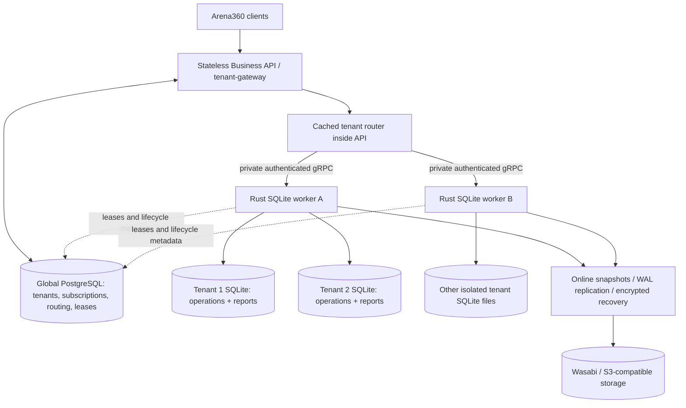

# Phase 1: networked tenant SQLite

Status: implemented as the default Cargo and container configuration. This
supersedes the earlier tenant DuckDB/NATS deployment proposal. Central analytics
is a future phase driven by measured reporting load.

## Service ownership

`tenant-gateway` runs control and router roles. It owns platform authentication,
PostgreSQL tenant/subscription management and provisioning requests, and routes
all tenant APIs to the current owner. It has no tenant database volume. The router
is a module, so Phase 1 needs two Rust service types rather than another router
process. Gateway instances scale independently.

`tenant-storage` runs the cell role. Each worker owns multiple tenant SQLite
files on a persistent local volume. It checks current user and venue permissions,
executes existing typed business commands and repositories, and serves reports
from the same SQLite file. One active lease-fenced owner writes each tenant.
Workers also own schema migrations, provisioning/seeding, WAL capture, online
snapshots, encrypted object uploads, restore validation, tenant moves and cold
hydration. PostgreSQL remains their control connection for leases and lifecycle
records; tenant business data remains in SQLite.

Private `TenantStorageService.Invoke` transports the existing API envelope;
`Provision` carries the validated tenant provisioning request. Public REST and
protobuf clients retain their contracts. Service-token authentication is separate
from tenant JWT authentication, which the worker rechecks. RPCs use deadlines,
bounded messages, reused channels and no automatic retry of uncertain writes.
Database paths and arbitrary SQL are not public RPC operations. Realtime uses
the existing gateway-to-owner streaming proxy.

## Reporting

All existing dashboard, finance, credit, expense and inventory report APIs work
with default features. Each report reader holds one read-only SQLite transaction;
queries composing a dashboard share that snapshot, even when writes commit
between queries. Reports include commits visible when that snapshot opens. A
short response cache can reuse a result until its TTL; cache identity includes
tenant, ownership generation, schema, timezone, outbox sequence and venue scope.

Migration `0018_sqlite_reporting.sql` adds secret-free ordinary views and report
range indexes. Views do not duplicate data or maintain an asynchronous projection.
Amounts remain scale-4 INTEGERs through ledger aggregation; exact finance values
use decimal strings, while existing dashboard DTOs use floating-point display
values. UTC timestamp predicates stay indexable. Tenant calendar labels and hour
splitting account for IANA timezones and DST; finance exports retain UTC dates.
Unused stations contribute zero occupancy.

The reusable `sqlite-reporting` crate owns native read connections, calendar and
money functions, snapshot admission, and result limits. The core adapter owns
lease checks, authorization scope and public report DTOs. Admission permits two
reports per tenant and eight per worker. Snapshots expire after 25 seconds;
SQLite's progress handler interrupts expensive SQL. Each query is limited to
10,000 rows and 4 MiB, with an explicit error rather than silently truncating.
See [reporting and dashboard definitions](analytics.md).

## Events and later centralized analytics

DuckDB and NATS are not dependencies of Phase 1 reporting or provisioning.
Transactional versioned outbox snapshots remain available for integrations and a
future central analytics engine. When `NATS_URL` is configured, the existing
publisher waits for durable JetStream acknowledgments before removing events
that realtime has also projected. An outage preserves unacknowledged events.

With no external event sink, local retention removes only realtime-projected
outbox events older than `OUTBOX_RETENTION_DAYS` (default seven), in bounded
batches. Operational rows and ledgers are retained. Historical outbox replay is
therefore not a complete bootstrap mechanism: a future analytics consumer must
start from a consistent SQLite snapshot and catch up from its sequence.

Legacy DuckDB projection/archive code remains behind the explicit
`duckdb-analytics` feature for existing historical workflows and compatibility
tests. Default images omit its SDK, extensions and archive executables. Activating
that feature selects the compatibility reporting backend; it is not the Phase 1
production configuration.

## Durability and deployment

SQLite commits confirm local durability. Wasabi snapshots and WAL uploads are
asynchronous; recovery uses their persisted manifests, checksums and recoverable
encryption keys. Keep keys on separate durable storage and configure the existing
replication settings. Report views rebuild through schema migrations during
provisioning or recovery; no analytics file or broker replay is needed to make
Phase 1 reports available.

Use a distinct cell UUID, service address and volume per worker. Add capacity by
registering another cell and assigning/moving tenants through PostgreSQL control
metadata. Do not scale a worker sharing one SQLite volume to multiple replicas.
The Helm chart supports combined, gateway-only and worker-only releases; the
worker uses `Recreate` updates and a retained PVC. PostgreSQL and Wasabi remain
external services. See [deployment](../operations/two-rust-services.md) and
[workspace ownership](project-structure.md).
