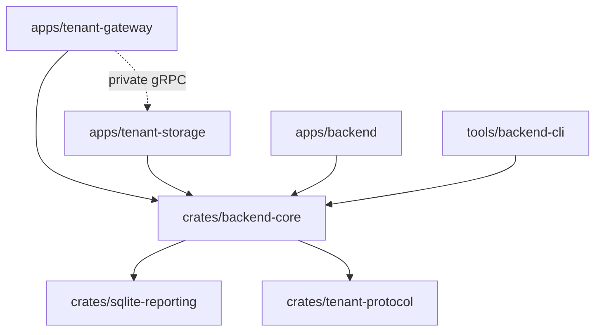

# Project structure

The [network database service architecture](network-database-service.md) defines
the service responsibilities, tenant event pipeline, provisioning lifecycle,
and the implemented SQLite-only Phase 1 deployment.

Run workspace commands from the repository root. Cargo owns Rust services and
libraries; pnpm owns frontend apps and TypeScript packages. Dependency versions
for shared Rust libraries live in the root `Cargo.toml`, with one root `Cargo.lock`.
The kiosk's Tauri workspace retains its own lockfile and release lifecycle.

Development and test profiles disable incremental compilation and keep line-table
debug information. This limits disk growth while retaining backtrace locations.
After the workspace migration, `apps/backend/target/` is an obsolete generated
build directory; all workspace packages now use the root `target/`. Cargo cleanup
must target the appropriate directory, for example
`cargo clean --target-dir apps/backend/target`. Full debugging symbols can be
enabled when needed with `CARGO_PROFILE_DEV_DEBUG=2`.

```text
apps/                         Runnable applications
  tenant-gateway/             Stateless PostgreSQL API and tenant routing
  tenant-storage/             Persistent SQLite operations and reports
  backend/                    Compatibility launcher for the combined backend
  admin/                      Staff console
  tenant/                     Platform tenant management portal
  kiosk/                      Station client and its independent Tauri workspace
crates/                       Shared Rust packages
  backend-core/
    src/                      Existing application and database implementation
    migrations/               Control, tenant, and analytics schemas
    tests/                    Core behavior and database integration tests
  sqlite-reporting/            Bounded read snapshots and calendar/ledger functions
  tenant-protocol/
    proto/public/             Public API and realtime wire contracts
    proto/storage.proto       Private service-to-service contract
    src/                      Generated contract module entry points
tools/
  backend-cli/
    src/bin/                  Operator commands and maintenance workers
    scripts/                  Demo, benchmark, report fixture, integration runners
    tests/                    Tests that execute operator binaries
packages/                     Shared frontend code and generated clients
  api-types/openapi.json      Generated OpenAPI specification
  proto/src/gen/              Generated TypeScript protobuf client
infra/
  docker/                    Rust multi-target image build (SQLite by default)
  helm/                      Service and frontend deployment charts
scripts/                      Root workspace automation and client generators
docs/
  architecture/              Current architecture and development guides
  operations/                Deployment and operator procedures
  adr/                       Architecture decision history
  plans/                     Implementation plans and progress
planning/                     Product milestone and planning metadata
```

## Package boundaries



Application entry points select a runtime role and start it. Shared Rust code
belongs in `crates/`; it must not depend on code under `apps/` or `tools/`.
The protocol package owns serialization and generated bindings and has no
database or application dependencies. Operator tools reuse the core API rather
than importing application entry points.

`arena360-core` retains the existing `gaming_cafe_api` Rust import name to keep
this extraction compatible. Its existing layers remain explicit: `handlers/`
and `rpc/` adapt APIs, `services/` implement operations, `repositories/` persist
records, `control/` manages PostgreSQL metadata, and `tenancy/`, `replication/`,
and `analytics/` manage tenant SQLite lifecycle and reporting. Cross-cutting
modules such as authentication, configuration, and realtime remain in the core.
This is one shared implementation crate today; domain crates should be extracted
when their dependencies can be isolated without duplicating transaction logic.

## Where to make changes

| Change | Location | Validation |
| --- | --- | --- |
| Process startup or fixed service roles | `apps/tenant-*/src/main.rs`, core `runtime.rs` | Workspace check, core runtime tests |
| Tenant API behavior | Core `handlers/`, `services/`, `repositories/` | Relevant core integration test |
| Private gRPC behavior | Core `storage_rpc.rs`, protocol `proto/storage.proto` | Core `storage_rpc` tests |
| Public protobuf API | Protocol `proto/public/` | `pnpm lint:proto`, `pnpm gen:proto` |
| Database schema | Core `migrations/control`, `tenant`, or `analytics` | Migration and relevant schema tests |
| Operator command | `tools/backend-cli/src/bin/` | Tool unit/integration tests |
| REST schema or frontend API types | Core `openapi.rs` and DTOs | `pnpm gen:api-types` |
| Container or Kubernetes deployment | `infra/docker/`, `infra/helm/` | Container build or Helm validation |
| Frontend behavior | Relevant `apps/` package | Its typecheck, test, and build |

Do not edit generated OpenAPI, TypeScript API types, or protobuf clients by hand.
Keep migrations beside the crate that embeds and applies them. Existing
migration contents and versions were preserved during the move. Tests that
execute CLI binaries belong to `arena360-tools`; the historical export fixture
reuses the core's existing test support through an explicit source path.

## Commands and configuration

| Task | Root command |
| --- | --- |
| Build an allowlisted Rust image | `pnpm rust:image --target storage --tag REGISTRY/IMAGE:VERSION` |
| Check all Rust packages and test targets | `pnpm rust:check` |
| Build the two service binaries | `pnpm services:build` |
| Run gateway / storage | `pnpm gateway:dev` / `pnpm storage:dev` |
| Run the combined compatibility server | `pnpm backend:dev` |
| Run core and operator tests | `pnpm backend:test` |
| Run all Rust workspace tests | `pnpm rust:test` |
| Run isolated PostgreSQL/SQLite integration tests | `pnpm backend:test:integration` |
| Build operator tools | `pnpm tools:build` |
| Run one operator command | `cargo run -p arena360-tools --bin COMMAND -- ARGS` |
| Generate a migration | `pnpm migration generate NAME --target control\|tenant` |
| Generate public clients | `pnpm gen:proto`, `pnpm gen:api-types` |
| Check frontend apps | `pnpm typecheck`, `pnpm test` |

Copy `.env.example` to `.env` at the repository root for local development.
Rust startup, migration tooling, and the demo runner use this file and retain
`apps/backend/.env` as a fallback. Exported process variables win. A shared
local file is convenient, but each deployed service receives its own environment
and port. Tenant files and backup keys belong on storage volumes, outside source
directories.

Both services use SQLite-only Phase 1 defaults. Reporting's native connection and
snapshot engine lives in `crates/sqlite-reporting`; its ownership/scope adapter and
SQL/DTOs live in the core analytics module. The optional `duckdb-analytics` feature
selects legacy historical compatibility and is excluded from default images.

External database/broker tests retain their explicit infrastructure gates.

See [two-service setup and deployment](../operations/two-rust-services.md) for
the service configuration, private gRPC routing, persistent volumes, and image
build commands. [Storage-cell development](storage-cell-development.md) covers
SQLite reporting and tenant ownership setup.
